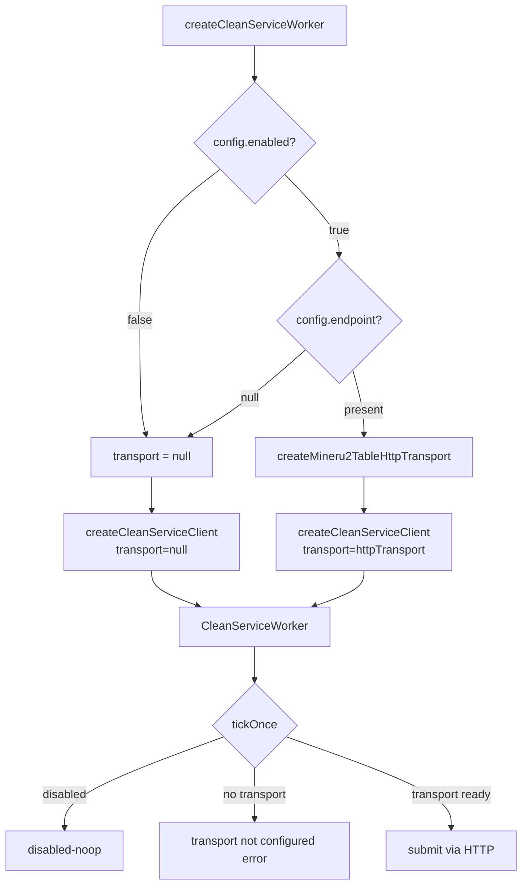

# CleanService Worker Transport Factory & Retriable Error Semantics Report

## 1. Executive Summary (摘要)

本报告记录 **TASK-20260521-122652-P0-CleanService-Mineru2Table-Worker-Transport-Factory-And-Retriable-Error-Semantics** 的完整执行结果。

根据任务书要求，已精准完成以下工作：
1. **新增 Worker Factory 模块**：`worker-factory.mjs` 提供 `createCleanServiceWorker()` 和 `createCleanServiceClientWithTransport()` 工厂函数，当 `CLEANSERVICE_ENABLED=true` 且 `endpoint` 已配置时自动注入 HTTP transport。
2. **修复 retriable 语义传播**：`protocol.mjs` 中 `normalizeCleanServiceTransportError` 现在保留 transport 层的 `retriable=true`（5xx 错误），不再仅限 timeout。
3. **新增 8 场景 mock HTTP smoke test**：全部通过。
4. **零回归**：5 个既有 cleanservice smoke test 全部通过。
5. **零真实调用**：没有任何请求到达 `127.0.0.1:8000`。

---

## 2. Changed-File Audit (变更文件审计)

新增 2 个文件，修改 1 个文件：

```
 server/services/cleanservice/protocol.mjs             | 1 modified line
 server/services/cleanservice/worker-factory.mjs       | [NEW] 83 lines
 server/tests/cleanservice-worker-factory-smoke.mjs    | [NEW] 411 lines
 3 files changed, 495 insertions(+), 1 deletion(-)
```

### A. `protocol.mjs` — retriable 语义修复
```diff
-      retriable: timeout,
+      retriable: timeout || error?.retriable === true,
```

单行精准改动：当 transport 抛出的 error 对象携带 `retriable=true`（如 5xx），该值现在被保留到 normalized client result。

### B. `worker-factory.mjs` — 工厂模块（新增）
- `createCleanServiceWorker()`: 构造含 HTTP transport 的 worker
- `createCleanServiceClientWithTransport()`: 构造含 HTTP transport 的 client（不含 worker 层）
- 逻辑：仅当 `config.enabled && config.endpoint` 同时为真时创建 transport，否则 transport 为 null

### C. `cleanservice-worker-factory-smoke.mjs` — smoke test（新增）
- 8 个场景全部使用临时 mock HTTP 服务器

### 未修改文件确认
- `cleanservice-worker.mjs` — 未修改
- `config.mjs` — 未修改
- `http-transport.mjs` — 未修改
- `raw-material-adapter.mjs` — 未修改
- 前端 `src/**` — 零变更
- Docker/Compose/env/secrets — 零变更
- DB migrations — 零变更
- Upload-server / scheduler — 零变更

---

## 3. Final Branch And Commit SHA

- **分支**：`lucode/task-229-worker-factory-retriable`
- **最终 SHA**：`5c759a1d5e270c6a63edbfd55daab88823b6c568`
- **父提交**：`e230005bef043697f88bb06c73c445626be58bd9`（Task 229 任务书下发 SHA）
- **GitHub 远端**：已推送至 `origin/lucode/task-229-worker-factory-retriable`

---

## 4. Factory/Wiring Design Summary (工厂设计概要)



关键设计决策：
- factory 不激活任何 scheduler 或 timer
- 缺少 endpoint 时 transport 设为 null → client 报告 explicit transport failure
- 所有 cost/timeout 参数从 config 透传

---

## 5. Mock Request Payload Evidence (mock 请求载荷)

Test [2] 捕获的 `POST /api/v1/jobs` 载荷：

```json
{
  "job_id": "luceon-task-factory-1-toc-rebuild-v1",
  "material_id": "mat-factory-1",
  "parse_task_id": "task-factory-1",
  "asset_version": "v1",
  "inputs": [{
    "role": "mineru-content",
    "source": {
      "type": "minio",
      "bucket": "eduassets-raw",
      "object": "mineru/mat-factory-1/v1/content_list_v2.json"
    },
    "hash": "sha256-factory-fixture"
  }],
  "sink": {
    "type": "minio",
    "bucket": "eduassets-clean",
    "prefix": "toc-rebuild/mat-factory-1/v1/"
  },
  "callback_secret_ref": "TOC_REBUILD_CALLBACK_SECRET",
  "options": { "max_cost_cny": 8 }
}
```

---

## 6. Error Semantics Evidence (错误语义证据)

| Scenario | HTTP Status | `job.error.retriable` (before fix) | `job.error.retriable` (after fix) | Status |
|---|---|---|---|---|
| 4xx (422) | 422 | false | false | ✅ non-retriable |
| 5xx (503) | 503 | **false** | **true** | ✅ **FIXED** |
| Timeout | N/A | true | true | ✅ retriable |

5xx 的 `retriable` 传播链：
1. `http-transport.mjs` → `error.retriable = response.status >= 500` → `true`
2. `protocol.mjs` catch → `normalizeCleanServiceTransportError(error)`
3. `retriable: timeout || error?.retriable === true` → `true` ✅

---

## 7. Focused Smoke Test Commands And Exit Codes

### New Worker Factory Smoke (8/8)
```bash
$ node server/tests/cleanservice-worker-factory-smoke.mjs
# exit code: 0

=== CleanService Worker Factory & Retriable Semantics Smoke ===
  [1] disabled/default factory path makes zero HTTP requests... PASS
  [2] enabled mock factory path submits exactly one POST /api/v1/jobs... PASS
  [3] missing endpoint makes zero HTTP requests and reports explicit failure... PASS
  [4] legacy parsed-only task makes zero HTTP requests... PASS
  [5] 4xx result is non-retriable at normalized client result... PASS
  [6] 5xx result is retriable at normalized client result... PASS
  [7] timeout remains retriable at normalized client result... PASS
  [8] no test targets 127.0.0.1:8000... PASS
PASS cleanservice worker factory & retriable semantics smoke (8/8)
```

### Existing Smoke Regression (5/5)
```bash
$ node server/tests/cleanservice-http-transport-smoke.mjs     # exit 0 — PASS 7/7
$ node server/tests/cleanservice-worker-shell-smoke.mjs       # exit 0 — PASS
$ node server/tests/cleanservice-foundation-smoke.mjs         # exit 0 — PASS
$ node server/tests/cleanservice-raw-material-adapter-smoke.mjs  # exit 0 — PASS
$ node server/tests/cleanservice-asset-version-smoke.mjs      # exit 0 — PASS
```

---

## 8. Syntax/Type-Check Commands And Exit Codes

```bash
$ git diff --check                                    # exit 0 — PASSED
$ node -c server/services/cleanservice/worker-factory.mjs  # exit 0 — syntax OK
$ node -c server/services/cleanservice/protocol.mjs   # exit 0 — syntax OK
$ node -c server/tests/cleanservice-worker-factory-smoke.mjs  # exit 0 — syntax OK
$ npx tsc --noEmit                                    # exit 0 — no TypeScript errors
```

---

## 9. Safety Boundary Statement (安全边界声明)

- **零真实 Mineru2Table 调用**：没有任何 `POST http://127.0.0.1:8000/api/v1/jobs`。
- **零运行时激活**：无 scheduler、timer、upload-server 路由变更。
- **零 MinIO/LLM/DB 操作**：未读写任何存储或数据库。
- **零 Docker/env/secret 变更**：未修改部署配置。
- **零前端变更**：`src/**` 未触及。
- **Legacy parsed-only 安全**：验证 `skipped-policy` 不发 HTTP。
- **Default disabled-noop 保持**：`CLEANSERVICE_ENABLED=false` 行为不变。

---

## 10. Residual Risks And Deferred Side Work (遗留风险与后置工作)

### 已实现
- `createCleanServiceWorker()` / `createCleanServiceClientWithTransport()` 工厂
- 5xx → `retriable=true` 语义修复
- 8 场景 mock smoke 全覆盖

### 后置（按任务书明确）
- **真实 loopback dispatch**：启用 `CLEANSERVICE_ENABLED=true` + `CLEANSERVICE_ENDPOINT=http://127.0.0.1:8000`
- **运行时 flag 激活**：scheduler 或 upload-server 调用 factory
- **API-token 强制验证**：Luceon → Mineru2Table 的 `X-API-Key` 协商
- **Webhook callback endpoint**：回调签名验证
- **MinIO 输出验证**：真实 job 完成后的 artifact 验证
- **Operator UI 状态**：clean job 状态前端展示
- **Backoff scheduler**：基于 `retriable` 的重试策略

---

## 11. Final Status Recommendation (最终状态建议)

> [!IMPORTANT]
> **Lucode 角色建议**：本任务已完全实现所有正面验收条件——worker/client factory wiring、retriable 语义修复、mock 验证 8/8 通过、5 个既有 smoke 零回归、零真实调用。建议推荐为待审状态。

控制权与台账现在正式交还给 **Luceon** 角色。

---
*Reported by lucode on 2026-05-21.*
