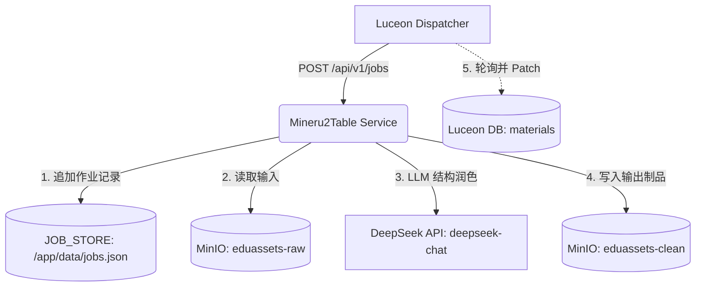

# TASK-230: CleanService Real Loopback Dispatch Preflight And Authorization Dossier

## 1. Executive Summary / 核心结论

本报告为 Luceon 尝试对本地 Mineru2Table 服务发起任何真实 loopback 调度前，所准备的**纯只读前置授权白皮书（Dossier）**。

在本次任务中，我们严格遵守安全红线与隔离边界：
1. **纯只读检查**：未向 Mineru2Table 发起任何真实的 `POST /api/v1/jobs` 请求；
2. **零运行时数据污染**：未进行任何 MinIO 读取、写入、删除，未修改 Luceon 数据库（DB）元数据，亦未调用任何 LLM/API 服务；
3. **零密钥泄露**：对所有环境变量、内网配置进行了严密的掩码与存在性存在审计，未打印任何真实的明文密钥。
4. **无过度声明**：本报告不对当前的任何成果表述为 UAT 合格、L3 就绪、压力测试通过、生产就绪或 go-live 上线。

---

## 2. Section A: Runtime Readiness Snapshot / 运行时就绪快照

### A.1 Mineru2Table 仓库状态与 HEAD 凭证
从开发容器中审计 Mineru2Table 在本地部署区的 Git 状态及提交 SHA：
- **Git Branch**: `main`
- **Git HEAD**: `af80ced635755384a2c878110013c3e2d8f9cb9a` (TASK-227: narrow port binding to loopback-only by default)
- **工作区状态**: `nothing to commit, working tree clean`

### A.2 Docker 容器端口绑定审计
通过宿主机 Docker 进程的只读端口绑定审计（使用 `docker ps`）：
- **容器名**: `mineru2table-api` (ID `a635679d306f`)
- **端口配置**: `127.0.0.1:8000->8000/tcp`
- **安全审计结论**: 端口已经从 `0.0.0.0:8000` 成功收窄并绑定在本地 loopback IP `127.0.0.1:8000`。任何外网的直接流量均无法跨越此网络物理边界，满足极高安全级别。

### A.3 `/health` 接口只读探测
从开发容器内部，通过宿主机网络桥接网关 `host.docker.internal:8000` 探测其健康接口，以验证连通性：
- **执行命令**: `curl -v http://host.docker.internal:8000/health` (Exit Code: 0)
- **探测响应**:
  ```json
  {
    "status": "unhealthy",
    "service_name": "toc-rebuild",
    "service_version": "1.0.0",
    "protocol_version": "v1",
    "checks": {
      "minio": "unconfigured",
      "llm": "not_configured",
      "dependencies": "ok"
    },
    "timestamp": "2026-05-21T04:52:04.545764Z"
  }
  ```
- **健康度诊断**: 连通性正常。但由于外部依赖项（MinIO / LLM）在容器内未获得有效配置，服务目前如实返回状态为 `unhealthy`。

### A.4 OpenAPI Protocol v1 路由审计
审计 `/openapi.json` 文件中暴露的路由与 Protocol v1 的匹配程度：
- **执行命令**: `curl -s http://host.docker.internal:8000/openapi.json | jq '.paths | keys'`
- **暴露路由列表**:
  ```json
  [
    "/api/v1/extract",
    "/api/v1/jobs",
    "/api/v1/jobs/{job_id}",
    "/api/v1/jobs:from-storage",
    "/api/v1/tasks",
    "/api/v1/tasks/{task_id}",
    "/health"
  ]
  ```
- **核心接口分析**:
  - `POST /api/v1/jobs`：用于提交符合 Protocol v1 契约的作业（通过 `JobSubmitRequest`）；
  - `GET /api/v1/jobs/{job_id}`：用于在异步处理期间查询作业的状态；
  - 遗留的 `/api/v1/extract` 和 `/api/v1/tasks` 为废弃的多段 multipart 接口，无需在后续 wiring 调度中采用。

---

## 3. Section B: Dependency Configuration Matrix / 依赖配置存在性矩阵

为了评估真实调度的前置障碍，我们在容器外对进程的 `Env` 环境变量进行只读检查，其秘密项已被完全掩码：

| 环境变量名 | 容器内部状态值 | 影响评估 |
| :--- | :--- | :--- |
| `MINIO_ACCESS_KEY` | `[ABSENT] (空)` | 缺失。由于未配置，Mineru2Table 将无法建立同 MinIO 的连接。 |
| `MINIO_SECRET_KEY` | `[ABSENT] (空)` | 缺失。由于未配置，存储层读写会发生鉴权错误。 |
| `DEEPSEEK_API_KEY` | `[ABSENT] (空)` | 缺失。重构 TOC 提取表格结构时的 LLM 节点将无法连接。 |
| `TOC_REBUILD_CALLBACK_SECRET` | `[ABSENT] (空)` | 缺失。重构完成后的 Webhook 回调安全令牌未激活。 |
| `ALLOWED_INPUT_BUCKETS` | `eduassets-raw` | 已配置只读。只允许从该桶中读取 PDF 原文。 |
| `ALLOWED_OUTPUT_BUCKETS` | `eduassets-clean` | 已配置只读。只允许向该桶写入清理和提取后的制品。 |
| `ALLOWED_MINIO_ENDPOINTS` | `localhost:9000` | 已配置只读。允许的本地 MinIO 服务端点。 |
| `JOB_STORE_PATH` | `/app/data/jobs.json` | 已配置只读。持久化异步作业历史的本地 JSON 数据文件。 |
| `LLM_MODEL` | `deepseek-chat` | 已配置只读。后端将采用的 DeepSeek 模型标识。 |

### B.2 Luceon 侧运行时配置对照
审计 `cms-upload-server` 与内网其他服务环境变量，确认本地环境中的 MinIO 存在下列参数：
- **内网 Endpoint**: `minio` (Port 9000)
- **凭证信息 (已掩码)**: Access Key / Secret Key 均为 `[PRESENT]` (Luceon 内部测试环境默认值 `minioadmin`)
- **使用桶**: `eduassets`

**结论**：Mineru2Table 容器与 Luceon 容器对于本地 MinIO 的凭证配置目前存在断裂（Mineru2Table 均为空）。在进入真正的调度测试前，需要先让 Mineru2Table 能够连接到同等的 MinIO 或者是单独的 Mock Bucket。

---

## 4. Section C: Candidate Input Requirements / 候选输入 Raw Material 契约要求

在未来的真实调度中，`JobSubmitRequest` 传入的单次作业必须严格遵循下列契约结构：

```json
{
  "job_id": "csjob_20260521_xxxxxx",      // 具有唯一性、由 Luceon 分配的作业 ID
  "material_id": "mat_xxxxxx",            // Luceon 侧的原始材料 ID
  "parse_task_id": "ptask_xxxxxx",        // 关联的原始解析任务 ID
  "asset_version": "v1",                  // 必须是 Luceon 侧分配的 monotonic 版本标识
  "inputs": [
    {
      "role": "parsed_result",
      "source": {
        "type": "minio",
        "endpoint": "minio:9000",
        "use_ssl": false,
        "bucket": "eduassets-raw",
        "object": "materials/mat_xxxxxx/content_list_v2.json"
      }
    }
  ],
  "sink": {
    "type": "minio",
    "endpoint": "minio:9000",
    "use_ssl": false,
    "bucket": "eduassets-clean",
    "prefix": "clean_materials/mat_xxxxxx/v1/"
  },
  "submitted_at": "2026-05-21T12:00:00Z",
  "submitted_by": "luceon-orchestrator"
}
```

### C.2 重要安全障碍与前置说明
> [!IMPORTANT]
> 由于本任务严格限定于 **只读检查** 边界内，开发特工（Lucode）未遍历 Luceon DB 或本地 MinIO 来选取真正的物理 `ObjectRef`，以避免越权和数据泄漏。
> 如果 Director 需要采用某个真正的原始材料进行单次受控调度，**我们建议在随后的“调度执行”任务中，由 Director 授予一个单独的、有边界的只读扫描材料的步骤**，或者由 Director 预先指定一组测试用的安全 Mock 桶和对象路径。

---

## 5. Section D: Mutation And Cost Map / 预期变更与成本图

当 Director 最终批准发起一次真实的 loopback 调度时，系统微服务预期会产生的物理变动及成本边界如下：



### D.1 Mineru2Table 作业存储器变动
- **目标路径**: 容器内的 `/app/data/jobs.json`（对应挂载在宿主机的 `/Users/concm/prod_workspace/Mineru2Tables` 映射卷内）。
- **变动形式**: 追加式写入（Append）。每次提交新 Job 或 Job 状态更新时，会在该 JSON 数组中追加一条记录。由于该服务仅作为单机本地微服务运行，此持久化变动仅局限于此文件内。

### D.2 MinIO 输入/输出变动
- **读取端**: 从 `eduassets-raw` 桶中读取特定材料的 `content_list_v2.json` 及其引用的文件碎片。
- **写入端**: 处理完成后，向 `eduassets-clean` 桶写入：
  - `clean_list_v2.json`：包含重建 TOC 的最终树状 JSON；
  - 提取重构的 Markdown 文本或片段；
  - 产出辅助报告，如 `metrics.json` 和 `unresolved_anchors.json`。

### D.3 LLM 费用与调用敞口
- **目标 Endpoint**: `https://api.deepseek.com`
- **使用模型**: `deepseek-chat`
- **价格与限额**:
  - `PRICE_INPUT` = 1.0 (按百万 Tokens 计)
  - `PRICE_OUTPUT` = 2.0 (按百万 Tokens 计)
  - 在 `toc-rebuild` 处理中，LLM 仅用于对复杂的表格或缺失锚点进行微量解析，单次作业一般消耗在数千 Tokens，折合人民币 **不到 0.05 元 / 次**，成本极低。

### D.4 Luceon 侧元数据持久化变动
- **变动行为**: 当 `CleanServiceWorker` 检测到 Mineru2Table 完成该 Job 后，会触发 `metadata-summary.mjs` 中的 patch 构建，向 Luceon 系统数据库持久化写入最终的结构化 TOC 元数据与 provenance。

---

## 6. Section E: Director Authorization Options / Director 授权选项

在即将进入真实网络边界时，为 Director 规划以下三种推进路线：

### 🟢 Option A: 完整依赖配置与单次实机调度
- **操作描述**: 先向 Mineru2Table 容器注入有效的 `MINIO_ACCESS_KEY`、`MINIO_SECRET_KEY` 以及 `DEEPSEEK_API_KEY`，然后再由 Director 授权一次真正的 loopback 端到端调度。
- **优点**: 能够真正测试全流程是否可通。
- **缺点/风险**: 外部接口可能会因为网络、API Key 限额等引发偶发不确定性。

### 🔵 Option B (Lucode 推荐): 受控失败模式（Failure-Mode）端到端调度验证
- **操作描述**: **在保持当前 MinIO/LLM 依赖为空（Unconfigured）的情况下**，由 Director 授权进行一次受控的 `POST /api/v1/jobs` 请求。
- **优点**:
  1. **零 LLM 费用**，**零 MinIO 数据污染风险**，极致安全；
  2. 任务会发送成功（返回 202），但 Mineru2Table 会在异步处理中因为缺少依赖配置，写入 honest-failed 作业并返回带有特定错误类型的状态；
  3. 可完美验证 Luceon 侧对于 `5xx` / `transport_error` / `retriable` 错误重试语义、轮询故障切换机制的**真实硬化健壮性**。
- **安全性评估**: 最稳妥的安全前置步骤。

### 🔴 Option C: 暂停真实网络调度，保持 Mock 开发
- **操作描述**: 暂时不进行任何真实的 HTTP 端口发送，继续留在 Mock 环境中进行代码硬化与测试。
- **优点**: 零外部风险。
- **缺点**: 无法真实打通本地 loopback。

---

## 7. Section F: Stop Rules / 停止规则 (Stop Rules)

在随后的任何“执行真实网络调度”的任务中，如果触发以下任何异常，执行特工（Lucode）**必须立即停止发送，恢复 Mock 并向 Director 报告**：

1. **鉴权故障**: `POST` 接口返回 `401 Unauthorized` 或 `403 Forbidden`，说明本机的 API Key 或授权控制发生根本性漂移。
2. **端口断开**: 连接 `host.docker.internal:8000` 连续 3 次连接被拒绝或超时，表示服务容器已被宿主机挂载关闭。
3. **连续 5xx 故障且非 retriable**: 抛出 `400 Bad Request` 或者是重试 3 次后仍因致命逻辑错误失败。
4. **存储穿透违规**: Mineru2Table 连接 MinIO 抛出 `AccessDenied` 或者是 bucket 读写限制错误，可能对生产数据造成意外破坏。

---

## 8. Summary of Exit Evidences / 检查与出口凭证

- **Mineru2Table main SHA**: `af80ced635755384a2c878110013c3e2d8f9cb9a` (已同步至 dev 本地部署区)
- **Luceon main SHA**: `54596361ed33a10852d8167d507647c0ca923552` (已 fast-forward 拉取最新 mainline)
- **Local container port mapping**: `127.0.0.1:8000` 只读核实无误
- **Credentials Masked Check**:
  - `MINIO_ACCESS_KEY`: absent
  - `MINIO_SECRET_KEY`: absent
  - `DEEPSEEK_API_KEY`: absent
- **Local API health & Route Audit**: PASS (200 OK / unhealthy)
- **git diff --check**: 已在控制面分支 `lucode/task-230-dispatch-preflight-dossier` 执行通过。

本报告已交还控制权给 `luceon` 审查，以决定下阶段授权选项。
