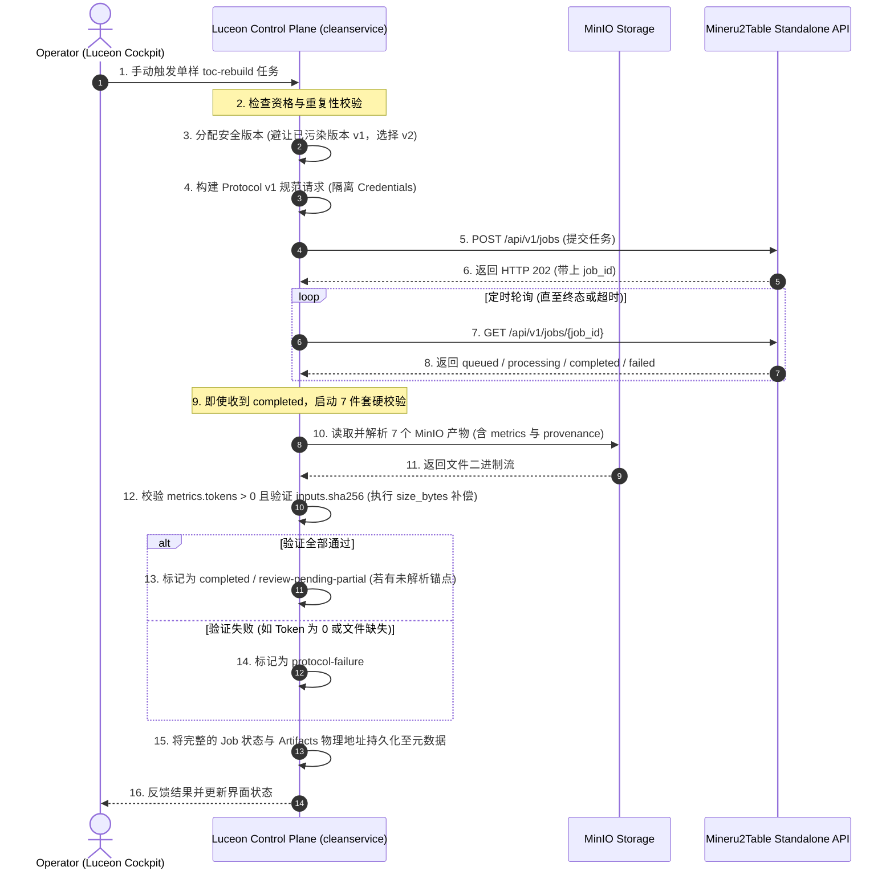

# Luceon 最小 Mineru2Table 编排与元数据接入设计 (Task 247)

## 1. 设计摘要 (Design Summary)

本设计针对 `Luceon2026` 资产管道中 `CleanService` 的首期引入，提出了一种**极简的、非破坏性的、由 Operator 手动触发的单样 `toc-rebuild` 编排设计**。
该设计吸取了 Task 242 运行态失败（LLM 401 报错却误判为 Completed）和 Task 245 运行态成功（完美写入 `v2` 干净前缀的 7 个 artifacts）的经验教训，在 `Luceon` 控制端构建了一套**不信任 `completed` 单一状态、基于 7 件套 MinIO 对象内容和 Provenance/Metrics 完整性双重锁校验**的“硬护栏”编排方案。

本设计的目标是为下一步单样手动编排提供一套“实现即就绪 (Implementation-ready)”的技术方案，绝不触碰现有的 Phase 1 自动化流水线。

---

## 2. 当前代码差距分析 (Current Code Gap Analysis)

在对当前 `/workspace/dev/Luceon2026` 工作区相关代码进行静态审计后，我们发现了以下三处关键的架构差距 (Gap)，必须在后续实现中进行针对性修复与补偿：

### 2.1 `output-verifier.mjs` 的“内存虚校验”与 7 件套缺失
* **现状**:
  - 仅在内存中验证了 5 个 artifacts (`flooded_content`, `logic_tree`, `readable_tree`, `skeleton`, `provenance`) 的 `ObjectRef` 结构是否合法，完全漏掉了 `unresolved_anchors` 和 `metrics` 两个关键产物（总计应为 7 个文件）。
  - 完全不读取 MinIO 中的真实文件，没有进行任何内容层面的验证（如 JSON 解析、Markdown 非空、Token 非零验证、SHA256 散列一致性校验）。
* **差距对策**:
  - 重新扩充 `REQUIRED_CLEAN_ARTIFACTS` 至 7 件套，强制包含 `metrics` 与 `unresolved_anchors`。
  - 引入 MinIO Client SDK，在验证器中真实读取这 7 个文件。
  - 对于 `metrics.json`，强制校验 `stats.tokens.total > 0`。若为 0 视为虚假 Completed，拦截并抛出 `PROTOCOL_FAILURE`（解决 Task 242 false-success 漏洞）。根据 Task 245 的真实 v2 成功样本，实际的 `cost_cny_actual` 返回为 `0.0`，因此门控不应强制要求 actual cost > 0，而是以非零 token 为主。

### 2.2 `provenance.json` 的 `input size_bytes = 0` 的服务 gap 与补偿
* **现状**:
  - standalone Mineru2Table 生成的 `provenance.json` 中虽然记录了正确的 inputs ObjectRef 和 SHA256，但目前其记录的 `size_bytes` 为 `0`（为当前已知的上游服务缺陷）。
* **差距对策**:
  - **Luceon 侧本地补偿机制**: 验证器 in 下载并解析 `provenance.json` 时，对比 inputs 的 `sha256` 是否与 Luceon 本地 Raw Material 文件的 SHA256 严格一致。
  - 若哈希匹配且 `size_bytes === 0`，由 Luceon 侧的 MinIO 客户端读取真实的 Raw Material 文件体积并予以填补，并在最终的持久化元数据中记录真实的 `size_bytes`，同时抛出系统硬性警告日志，将此列为未来进入批量自动化 (Batch Mode) 前 Mineru2Table 端必须修复的 hard prerequisite。

### 2.3 `asset-version.mjs` 的失败版本与污染前缀复用风险
* **现状**:
  - 虽然 `allocateAssetVersion` 会扫描历史 `cleanServiceJobs` 与 `cleanMaterials`，但它依赖于已成功落账登记的历史元数据。
  - **真实残留风险**:
    1. MinIO 物理存储上可能已经存在了失败的前缀目录（例如上一轮运行发生阻断或故障产生的 `v1` 物理残留），但在 Luceon 数据库元数据中却因为事务未完成或失败而未落账登记。
    2. 此时，分配器 (Allocator) 无法从元数据中查到该版本记录，依然会错误地重新分配已污染的 `v1` 版本，从而导致与 MinIO 既有对象重合，造成数据污染。
* **差距对策**:
  - 引入 **“MinIO 前缀物理存在性校验与物理退避机制”**：
    1. 在触发前置校验 (Trigger Preflight)、分配器分配版本或验证器校验时，主动检查 MinIO 对应的物理前缀目录是否存在（即对 `toc-rebuild/{materialId}/v{N}/` 进行 `listObjects` 或 `bucket` 物理前缀探查）。
    2. 一旦发现 MinIO 物理存储上已存在该前缀目录（即便元数据中没有登记），分配器也必须强制递增版本号，分配下一安全版本 `v{N+1}`（如 `v2`），彻底杜绝与未落账失败残留前缀的重合与物理覆盖。

---

## 3. 提议的最小编排架构 (Proposed Minimal Architecture)

为了保证开发的安全性和低耦合度，我们设计了一套**禁用默认、由 Operator 主动单样触发**的轻量编排管线：



### 3.1 核心步骤设计说明
1. **Entry Point (入口点)**:
   - 禁用自动调度和扫描。
   - 仅暴露出一个用于研发/UAT 内部调试的手动单样触发 API `POST /internal/cleanservice/toc-rebuild/trigger`，入参为 `taskId`。
2. **Eligibility (准入资格与跳过策略)**:
   - 检查对应的 Task 状态是否在 `ELIGIBLE_TASK_STATES` 内，且 `metadata.cleanServiceJobs` 中无正在进行或已成功的记录。
   - 保留 `skipped-policy`（对不包含 `content_list_v2.json` 的旧数据，记录为 `skipped-policy`，平滑跳过而不阻断流程）。
3. **Asset Versioning (版本分配)**:
   - 增加对 MinIO 物理前缀存在性的物理探查，避让未落账残留，一旦发现 `v1` 存在则自动升至 `v2`。
4. **Job Request Payload (请求体构建)**:
   - 严格按照 Protocol v1 格式构建，包含 `job_id`, `material_id`, `parse_task_id`, `asset_version`, `inputs`, `sink`, `callback_url`，并显式设定 `options.max_cost_cny = 8.0`（若上游要传入 `DEEPSEEK_API_KEY`，也必须走环境变量注入，禁止进入 HTTP Payload）。
5. **Dispatch & Polling (分发与轮询)**:
   - 第一阶段不依赖复杂的外部网络回调，采用安全、稳妥的“主动轮询”机制（`GET /api/v1/jobs/{job_id}`），可配以 webhook 签名验证（HMAC-SHA256，利用 `TOC_REBUILD_CALLBACK_SECRET`）做幂等二次确认。
6. **Output Verification (输出校验门控)**:
   - 强制拉取 7 个 artifacts。
7. **Persistence (元数据落地)**:
   - 落地至 `task.metadata` 和 `materialMetadata`。

---

## 4. 提议的持久化数据结构 (Proposed Data Shapes)

为了对整个编排历史、资源消耗及后续 Content Cleaning 进行完美的追溯，我们提议将数据结构标准化存储，不复制任何巨大文件的实际内容，仅保存其 `ObjectRef`：

### 4.1 `task.metadata.cleanServiceJobs.toc-rebuild` (编排 Job 详细追溯结构)
```json
{
  "jobId": "luceon-pt_1842780526581841-toc-rebuild-v2",
  "materialId": "sha256:f05394af3ad6107cdb7324fcffeb13fb43dcbcbaff46f838f291828867e182db",
  "parseTaskId": "pt_1842780526581841",
  "assetVersion": "v2",
  "cleanState": "completed",
  "unresolvedAnchorCount": 0,
  "submittedAt": "2026-05-22T05:22:00Z",
  "finishedAt": "2026-05-22T05:22:30Z",
  "stats": {
    "tokens": {
      "prompt": 152034,
      "completion": 8123,
      "total": 160157
    },
    "costCnyActual": 0.184
  },
  "artifacts": {
    "flooded_content": {
      "bucket": "eduassets-clean",
      "object": "toc-rebuild/1842780526581841/v2/flooded_content.json",
      "sha256": "8ecfa4a96bde5f14aefb4a983e93720bb5ff12bb",
      "size_bytes": 4823910
    },
    "logic_tree": {
      "bucket": "eduassets-clean",
      "object": "toc-rebuild/1842780526581841/v2/logic_tree.json",
      "sha256": "4b96bd8de5f14aefb4a983e93720bb5ffd54ba",
      "size_bytes": 204850
    },
    "readable_tree": {
      "bucket": "eduassets-clean",
      "object": "toc-rebuild/1842780526581841/v2/readable_tree.md",
      "sha256": "c3e3ecf6d90a9ab126b130fe687e65e56ff29a2b",
      "size_bytes": 10543
    },
    "skeleton": {
      "bucket": "eduassets-clean",
      "object": "toc-rebuild/1842780526581841/v2/skeleton.json",
      "sha256": "a3b2c3d4e5f60718a1b2c3d4e5f60718a1b2c3d4",
      "size_bytes": 8500
    },
    "unresolved_anchors": {
      "bucket": "eduassets-clean",
      "object": "toc-rebuild/1842780526581841/v2/unresolved_anchors.json",
      "sha256": "f5e6d7c8b9a01234567890123456789012345678",
      "size_bytes": 450
    },
    "metrics": {
      "bucket": "eduassets-clean",
      "object": "toc-rebuild/1842780526581841/v2/metrics.json",
      "sha256": "e2f3d4c5b6a70819202122232425262728293031",
      "size_bytes": 950
    },
    "provenance": {
      "bucket": "eduassets-clean",
      "object": "toc-rebuild/1842780526581841/v2/provenance.json",
      "sha256": "d4c3b2a10f9e8d7c6b5a49382716059483726150",
      "size_bytes": 3820
    }
  },
  "provenance": {
    "schema": "luceon-provenance/v1",
    "service": {
      "name": "toc-rebuild",
      "version": "1.0.0",
      "protocol_version": "v1"
    },
    "inputs": [
      {
        "role": "mineru-content",
        "bucket": "eduassets-raw",
        "object": "mineru/1842780526581841/v1/content_list_v2.json",
        "sha256": "f05394af3ad6107cdb7324fcffeb13fb43dcbcbaff46f838f291828867e182db",
        "size_bytes": 31543
      }
    ],
    "outputs": [
      { "role": "flooded_content", "object": "flooded_content.json", "sha256": "8ecfa4...", "size_bytes": 4823910 }
    ]
  }
}
```

### 4.2 `materialMetadata.cleanMaterials.toc-rebuild` (业务层干净元数据轻量映射)
```json
{
  "materialId": "sha256:f05394af3ad6107cdb7324fcffeb13fb43dcbcbaff46f838f291828867e182db",
  "latestVersion": "v2",
  "cleanState": "completed",
  "provenanceHash": "sha256:d4c3b2a10f9e8d7c6b5a49382716059483726150",
  "updatedAt": "2026-05-22T05:22:35Z"
}
```

---

## 5. 状态机与转移表 (State Machine & Transition Table)

根据 Mineru2Table 的状态与 Luceon 的业务边界，设计状态转移逻辑如下：

| Mineru2Table `status` | 运行态附加条件 | 映射 Luceon `cleanState` | 业务流转动作与后续处理 |
| --- | --- | --- | --- |
| `queued` / `processing` | 无 | `RUNNING` | 持续进行后台轮询，等待终态。 |
| `completed` | 7 件套校验通过 且 `unresolved_anchor_count === 0` | `COMPLETED` | 成功归档，标记资产彻底干净，流程结束。 |
| `completed` | 7 件套校验通过 且 `unresolved_anchor_count > 0` | `REVIEW_PENDING_PARTIAL` | 成功下载但存在未解析锚点，标记为“部分完成”，挂起至人工复核 Desk。 |
| `completed` / `processing` | 实际估算成本 $\ge$ `hardLimitCny` (8.0) | `HARD_LIMIT_FAILED` | 触发强硬切断电路，拦截并不予接受 MinIO 产物。 |
| `completed` / `processing` | 实际估算成本 $\ge$ `softLimitCny` (5.0) | `COST_DECISION` | 挂起轮询，将任务状态设为“成本决策待定”，等待 Operator 确认。 |
| `queued` / `processing` | 轮询等待时限超过系统设定的最大 MaxTimeout | `TIMEOUT` | 终止轮询，释放锁，抛出超时失败。 |
| `failed` | 无 | `PROTOCOL_FAILURE` | 写入底层失败历史。 |
| `completed` | 7 件套有文件缺失、JSON 解析失败、或 `tokens.total === 0` | `PROTOCOL_FAILURE` | 校验失败，彻底拦截，拦截任何假 Completion 并抛出严重系统警告。 |

---

## 6. 验证门控表 (Verification Gate Table)

对 7 件套 MinIO 对象制定如下强校验门控规则：

| 校验产物 | 物理文件名 | 格式 / 大小校验 | 核心内容校验规则 | 失败定性分类 |
| --- | --- | --- | --- | --- |
| flooded_content | `flooded_content.json` | JSON / 大小 $\ge$ 1KB | 必须是一个 JSON 数组 (Array of blocks)，其顺序与 flooding metadata 已通过只读审查，且结构非空。 | `PROTOCOL_FAILURE` |
| logic_tree | `logic_tree.json` | JSON / 大小 $\ge$ 100B | 必须能够解析出唯一的根节点，不可为空或虚无。 | `PROTOCOL_FAILURE` |
| readable_tree | `readable_tree.md` | Markdown / 大小 $\ge$ 10B | 内容非空，且必须以 Markdown 标题或正文开头（不可仅有换行符）。 | `PROTOCOL_FAILURE` |
| skeleton | `skeleton.json` | JSON / 大小 $\ge$ 500B | 必须符合 TOC 骨架 Schema。 | `PROTOCOL_FAILURE` |
| unresolved_anchors | `unresolved_anchors.json`| JSON / 大小 $\ge$ 2B | 可为空数组，但必须是合法的 JSON 列表。 | `PROTOCOL_FAILURE` |
| metrics | `metrics.json` | JSON / 大小 $\ge$ 100B | 必须满足 `stats.tokens.total > 0` 且 token 非零，对 `cost_cny_actual` 不作正数硬校验（因 v2 实际成功样本中 cost_cny_actual=0.0，此项只作为质量/计费 caveats 记录）。 | `PROTOCOL_FAILURE` |
| provenance | `provenance.json` | JSON / 大小 $\ge$ 1KB | 1. `schema === "luceon-provenance/v1"`<br>2. `inputs[0].sha256 === Luceon_Raw_Material_SHA256`<br>3. `size_bytes` 补偿逻辑验证。 | `PROTOCOL_FAILURE` |

---

## 7. 失败定性与分类表 (Failure Classification Table)

在编排及验证过程中，若发生失败，必须写入精细的错误定性分类以供架构总控决策：

* **`BLOCKED_CREDENTIAL_NOT_DELIVERED_TO_EXECUTOR`**
  - **产生场景**: 执行端未配置有效的 DeepSeek API Key（仅能感知到系统预设的 placeholder 占位符），导致无法发起实质调用。
  - **处理逻辑**: 立即安全中止，保持零变动，作为前置阻断记录归档。
* **`BLOCKED_LLM_RUNTIME_FAILURE`**
  - **产生场景**: 已经把凭证送达执行端，但在运行时，DeepSeek 返回了 HTTP 401 认证失败、403、502 暂时不可用，或者额度耗尽。
  - **处理逻辑**: 记录为运行时失败，释放任务，不可覆盖或重用当前前缀。
* **`PROTOCOL_FAILURE`**
  - **产生场景**: 任务在 Mineru2Table 端被标记为了 completed，但 7 件套门控校验失败（文件缺失、哈希不匹配、JSON 不合法、或是虚假的 Total Tokens === 0 欺骗）。
  - **处理逻辑**: 坚决予以拦截，将 cleanState 标为 `protocol-failure`，不予落地资产。
* **`TIMEOUT`**
  - **产生场景**: 轮询了超过规定时限，API 端依然没有到达终端状态。
  - **处理逻辑**: 标为 `timeout` 失败，释放轮询锁。
* **`HARD_LIMIT_FAILED`**
  - **产生场景**: 运行时实际估算成本超出了设定的 $8.0$ 元硬上限。
  - **处理逻辑**: 自动拦截并中止流程。

---

## 8. 开发卡片拆分 (Implementation Task Breakdown)

未来对该设计的实现可以完全解耦成以下 4 张干净的 mainline-first 卡片：

### Card 1: 建立手动 Operator 单样触发接口 (True Prerequisite)
* **目标**: 在 `Server` 侧编写专用的手动单样触发 API `POST /internal/cleanservice/toc-rebuild/trigger`。
* **验收条件**:
  - 支持传入单个 taskId；
  - 能够正确执行 Task 资格核验与 `skipped-policy` 退避；
  - 成功打印出分配的下一安全版本号（避开已污染版本），并成功向 Mineru2Table 发送 Protocol v1 请求。

### Card 2: 建立 7 件套 MinIO 对象拉取与内容强验证门控 (True Prerequisite)
* **目标**: 编写真正的 MinIO 下载与 7 件套文件内容校验器。
* **验收条件**:
  - 成功调用 MinIO SDK 逐一下载 7 个产物；
  - 对 7 个文件实现严格 of JSON/Markdown/Token-Non-Zero 校验；
  - 实现针对 `input size_bytes = 0` 的本地实际体积对比补偿逻辑；
  - 单元测试能完全覆盖并拦截 Task 242 那个虚假的 Completed 漏洞，将其正确判定为 `PROTOCOL_FAILURE`。

### Card 3: 建立编排轮询与元数据持久化存储落地 (True Prerequisite)
* **目标**: 实现轻量级轮询线程，并开发 `task.metadata` 及 `materialMetadata` 标准 shapes 的落地逻辑。
* **验收条件**:
  - 轮询能够处理超时、软硬限度成本状态；
  - 成功写入元数据；
  - 在 UAT/开发环境下能手动跑通并干净归档。

### Card 4: 编排控制面板 Cockpit 与批处理自动触发 (Deferrable Side Work)
* **目标**: 在 Operator UI 侧开发统一的“目录重建控制舱”面板，并接入自动扫描调度器。
* **验收条件**:
  - UI 侧可直观查看已成功、待复核的材料；
  - 支持批处理。此卡片在 Card 1-3 完全就绪前保持挂起。

---

## 9. 明确的非目标 (Explicit Non-Goals)

为了保证首期实现小巧、聚焦与 100% 安全，以下内容被显式划定为本期非目标 (Non-goals)：
1. **不进行任何自动扫描调度激活**: 不编写任何可能会在后台自动扫表并进行大量 dispatch 的 scheduler，所有第一次运行均由 Operator 显式触发。
2. **不开发任何 Operator 华丽 UI 面板**: 后台仅提供稳定的单触发 HTTP API，暂不开发任何前端 Cockpit。
3. **不对 RawMaterial2CleanMaterial 进行设计**: 不进行后续 normalize content 逻辑的编写，Mineru2Table 与 Luceon 的交互终点仅在于产出合格的 `toc-rebuild` 7 个结构化产物并记录在案。
4. **绝不进行 failed v1 覆盖与清理**: 坚决保留 Task 242 产生的失败现场（前缀不变），用新 assetVersion 进行物理隔离。
