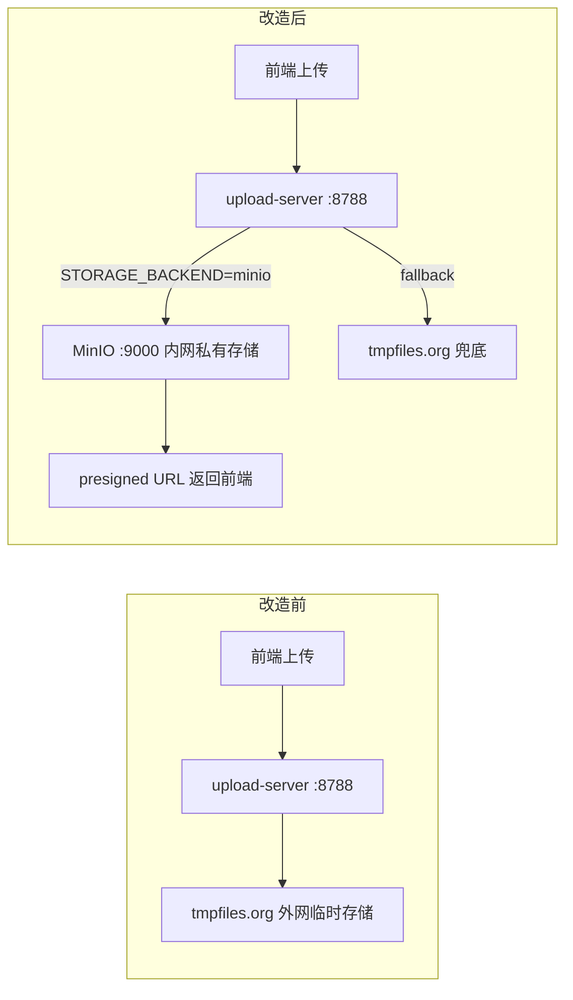

## 用户需求概述

用户提出三个独立但相关的工程问题，需要逐一制定解决方案并落地实施：

### 问题一：MinIO 文件持久化整合

当前文件上传通过 `upload-server` 中转到 `tmpfiles.org`（第三方临时公开存储），文件有过期风险且无私有化保护；业务数据全量存储在 localStorage（约 5MB 上限）。需要评估并实施 MinIO 私有对象存储替换 tmpfiles.org，作为第一步持久化改造，不涉及前端状态层和数据库层的重构（等功能稳定后再做）。

### 问题二：多功能分期开发整合与文档梳理

项目目前包含三个子系统混合在同一代码库：EduAsset CMS（原始资料/MinerU OCR/AI清洗/成品，其中 Cleancode 和成品生成尚未完成）、Overleaf 备份系统（需完善）、LaTeX 工具（需完善）。需要整理清晰的分期迭代计划，并在代码层面做好分组隔离标注，清理遗留的 .backup 文件，同步更新说明文档，使各阶段边界清晰可执行。

### 问题三：Token（证书）跨页面持久化问题

当前 `main.tsx` 中的 IIFE 只在硬刷新时执行一次，能从 URL `?token=xxx` 读取并写入 localStorage。但当用户直接访问子页面（如 `/backup`）并带有 token 参数时，若是 SPA 内部跳转（非硬刷新），`main.tsx` 不会重新执行，token 无法被写入，导致备份系统 API 请求无 token 而失败。需要在 React Router 层补充 token 监听，使任意页面任意进入方式均能捕获并持久化 token。

## 核心功能

- MinIO 接入：扩展 `upload-server.mjs`，新增 MinIO 存储后端，通过环境变量控制存储模式（MinIO 优先 / tmpfiles 兜底），同步更新 `server/Dockerfile` 和 `docker-compose.yml` 加入 MinIO 服务
- Token 修复：在 `Layout.tsx` 中加入基于 `useLocation` 的 `useEffect`，监听 URL search 参数，提取 token 写入 localStorage 并清除 URL 中的 token 参数（replace history），覆盖 SPA 跳转场景
- 分期整合：清理 `.backup` 遗留文件，更新 `说明文档.md` 补充分期迭代规划表，梳理各子系统边界与当前完成度

## 技术栈

沿用现有项目技术栈，不引入新前端框架：

- **前端**：React 18 + TypeScript + React Router 7（useLocation hook）
- **服务端**：Node.js ESM + Express 5 + multer（现有 upload-server.mjs 基础上扩展）
- **新增服务**：MinIO（Docker 官方镜像 `minio/minio`），通过 `minio` npm 包（MinIO JavaScript SDK）接入
- **容器编排**：Docker Compose（现有 `docker-compose.yml` 扩展新增 minio 服务）
- **配置管理**：环境变量（`.env` 文件），遵循现有 `docker-compose.yml` 的 `${VAR:-default}` 模式

---

## 实施方案

### 问题三（Token）—— 优先实施，改动最小，收益立竿见影

**根因**：`main.tsx` 的 IIFE 是一次性执行的模块级代码，SPA 内部路由跳转不触发页面重载，故 `?token=xxx` 参数在 SPA 内部跳转时无法被处理。

**方案**：在 `Layout.tsx` 的 `Layout` 函数组件内，利用已有的 `useLocation` hook（已导入），添加一个 `useEffect` 监听 `location.search` 变化，提取 token 并调用已有的 `setBackupToken()`（`backupApi.ts` 中已导出），然后用 `navigate` replace 清除 URL 中的 token 参数，防止 token 暴露在浏览器历史记录和服务器日志中。

**完整覆盖场景**：

- 硬刷新任意 URL 带 token → `main.tsx` IIFE 处理（保持不动）
- SPA 内部跳转带 token → Layout `useEffect` 处理（新增）
- 刷新后无 token 参数 → localStorage 已有值，正常读取（无需处理）

### 问题一（MinIO）—— 扩展 upload-server，零前端改动

**方案**：在 `upload-server.mjs` 中新增 `uploadToMinio()` 函数，通过环境变量 `STORAGE_BACKEND=minio` 切换存储后端。MinIO 存储后桶内文件通过 MinIO 本身的 presigned URL（预签名 URL，有效期可配）或公开策略返回可访问链接，格式与现有 `tmpfiles.org` 返回的 URL 结构兼容，前端无需任何改动。

**降级策略**：若 `STORAGE_BACKEND` 未设置或 MinIO 上传失败，自动回退到 tmpfiles.org，保证兼容性。

**Docker Compose 扩展**：新增 `minio` 服务，使用官方 `minio/minio` 镜像，数据目录挂载宿主机卷，通过 `cms-network` 内部通信。upload-server 通过内部 DNS `minio:9000` 访问，不对外暴露 MinIO API 端口（可选暴露 Console 端口用于管理）。

**`minio` npm 包选择**：使用官方 `minio` JavaScript SDK（`import { Client } from 'minio'`），支持 ESM，与现有 `upload-server.mjs` 的 ESM 模块系统完全兼容。

### 问题二（分期整合）—— 文档+代码注释+清理

**方案**：

1. 删除 `src/app/pages/SourceMaterialsPage.tsx.backup` 遗留文件
2. 在 `说明文档.md` 新增"三、分期迭代规划"章节，明确三个子系统边界、当前完成度、各阶段任务清单
3. 在 `src/app/App.tsx` 路由配置中补充清晰注释，标注各路由所属子系统和完成状态
4. 在 `src/app/components/Layout.tsx` 的导航分组中，对未完成功能添加视觉标注（可选：在导航项 label 旁加"（开发中）"文字标注）

---

## 实施注意事项

- **Token 清理时机**：用 `navigate({ pathname, search }, { replace: true })` 替换历史记录，而非 `push`，避免用户点后退回到带 token 的 URL
- **Token 不覆盖空值**：`useEffect` 中只在 `token` 非空时才调用 `setBackupToken()`，防止无 token 的正常导航清除已有 token
- **MinIO bucket 初始化**：upload-server 启动时自动检查 bucket 是否存在并创建，避免首次上传失败
- **MinIO URL 格式**：返回给前端的 URL 需与现有 tmpfiles 格式兼容（`{ url, fileName, size, mimeType, provider }`），`provider` 字段改为 `'minio'`，前端 `SourceMaterialsPage.tsx` 只使用 `url` 字段，无需改动
- **环境变量命名**：遵循现有 `docker-compose.yml` 的命名风格（全大写下划线），新增 `MINIO_ENDPOINT`、`MINIO_PORT`、`MINIO_ACCESS_KEY`、`MINIO_SECRET_KEY`、`MINIO_BUCKET`、`STORAGE_BACKEND`
- **不动 localStorage 层**：本次不改动 `src/store/appContext.tsx` 和任何 Reducer，业务数据迁移留到后续迭代
- **Layout 性能**：`useEffect` 依赖数组设置为 `[location.search]`，仅在 search 变化时触发，不影响路由渲染性能

---

## 架构变化（问题一）



---

## 目录结构

```
/workspace/ops/Luceon2026/
├── src/
│   ├── app/
│   │   ├── App.tsx                              # [MODIFY] 路由注释补全，标注子系统归属和完成状态
│   │   ├── components/
│   │   │   └── Layout.tsx                       # [MODIFY] 新增 useEffect + setBackupToken，修复Token SPA跳转场景；导航项标注开发中状态
│   │   └── pages/
│   │       └── SourceMaterialsPage.tsx.backup   # [DELETE] 清理遗留备份文件
├── server/
│   └── upload-server.mjs                        # [MODIFY] 新增 MinIO 存储后端，环境变量控制，失败自动降级
├── docker-compose.yml                           # [MODIFY] 新增 minio 服务，配置数据卷和网络，upload-server 增加 MinIO 环境变量
├── 说明文档.md                                   # [MODIFY] 新增"三、分期迭代规划"章节，梳理三子系统边界与各阶段任务
└── DEPLOY.md                                    # [MODIFY] 更新架构概览（加入 MinIO 容器）、EduAsset CMS 依赖服务表（tmpfiles → MinIO）、Token 章节补充 SPA 跳转说明、常见问题补充 MinIO 相关 Q&A
```