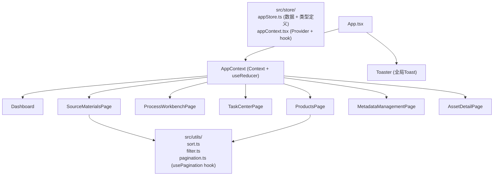

## 用户需求

基于现有的教育资产管理平台（EduAsset CMS）前端项目，完成所有交互逻辑、状态管理和业务功能的开发，使其达到可用于生产环境的完整程度。

## 产品概述

一个教育内容资产管理系统，支持原始资料上传入库、AI智能分析打标签、多阶段内容处理流水线（原始资料 → Rawcode → Cleancode → 成品）、任务监控与人工审核、元数据与标签统一管理。系统目前已有完整的页面视觉框架（7个页面），但全部数据为硬编码静态数据，所有操作按钮和交互均无实际逻辑。

## 核心功能（待完成）

### 1. 全局状态管理层

将各页面硬编码的 Mock 数据统一迁移至全局 Store，支持跨页面数据联动（如上传后资料库数量+1、审核通过后状态同步到 Dashboard）。

### 2. 原始资料库（SourceMaterialsPage）

- 左侧筛选面板 checkbox 与数据联动（学科/学段/课程标准/格式/资料类型/AI状态多维度筛选）
- 排序逻辑实现（按最新/最早/名称/大小真实排序）
- 分页逻辑实现（每页展示固定条数，页码切换更新列表）
- 上传弹窗：表单校验（至少选择文件）、确认后向列表插入新条目并提示成功
- 批量打标签弹窗：确认后将标签写入已选中的资料条目、弹出成功提示

### 3. 处理中心（ProcessWorkbenchPage）& 任务中心（TaskCenterPage）

- 审核通过/驳回按钮：操作后更新任务状态（reviewing → completed/failed），并在同一列表中即时反映
- 重新执行任务：将 failed 状态的任务重置为 pending，给予操作反馈
- 暂停/启动按钮：processing ↔ pending 状态切换
- 类型筛选 select 和优先级 select 与列表联动

### 4. 元数据管理（MetadataManagementPage）

- AI规则开关 toggle 可点击切换 enabled/disabled 状态并即时显示
- 灵活标签分类过滤按钮真实联动
- 执行设置的 checkbox 可点击保存状态

### 5. 成品库（ProductsPage）& 资产详情（AssetDetailPage）

- 成品库排序逻辑实现（最新/使用最多/评分最高）
- 权限设置"保存"按钮给予操作确认反馈

### 6. 全局 Toast 通知系统

利用已安装的 sonner 库，为所有操作（上传成功、标签添加成功、审核通过、驳回、重跑任务等）提供统一的 Toast 反馈。

### 7. 项目文档

在 guidelines/Guidelines.md 中补充项目开发规范文档，描述架构决策、数据结构、组件使用规范及各页面的功能说明。

## 技术栈

- **框架**：React 18 + TypeScript（现有）
- **样式**：Tailwind CSS 4（现有）
- **组件库**：已安装的 shadcn/ui（46个组件），优先使用 `Switch`、`Checkbox`、`Dialog`、`Pagination`、`Toast (Sonner)`、`Select`、`Form` 等
- **状态管理**：React Context + useReducer（轻量方案，无需引入新依赖）
- **通知反馈**：sonner（已安装）
- **路由**：react-router-dom v7（现有）

## 实现方案

### 核心策略

采用 **集中式 Mock Store + Context 分发** 模式：将所有页面硬编码的静态数据提取到 `src/store/` 中，通过 `AppContext` 向下注入，每个页面通过 `useAppStore()` hook 读写，无需引入 Redux/Zustand 等外部库，保持架构轻量、与现有代码风格一致。

### 关键技术决策

1. **状态管理选型**：项目规模为中等复杂的单页应用，数据以 Mock 静态数据为主，跨页面共享需求有限且明确（资料数量、任务状态）。使用 Context + useReducer 完全满足需求，避免引入 Zustand/Redux 带来的新模式学习成本与迁移风险。

2. **shadcn/ui 组件启用策略**：已安装 46 个组件但页面内完全未使用，本次全面接入。`Switch` 替换 AI 规则开关（消除 readOnly 问题）；`Dialog` 替换手写弹窗；`Sonner` 提供全局 Toast；`Pagination` 替换静态分页；`Checkbox` 替换 filter 面板原生 input；`Select` 替换原生 select（保持代码一致性，非强制，保持现有样式的不强行替换）。

3. **分页实现**：使用纯前端分页，`ITEMS_PER_PAGE = 12` 配置常量，分页逻辑封装到 `usePagination` 自定义 hook，所有列表页复用。

4. **筛选/排序逻辑**：在各页面内 `useMemo` 派生过滤后的数据，依赖 filter state + 数据源；排序函数封装为纯函数在 `src/utils/sort.ts` 中。

5. **Toast 系统**：在 `App.tsx` 的 `<BrowserRouter>` 外层加入 `<Toaster />` 组件，通过 `toast.success/error/info` API 全局调用，无需 prop drilling。

### 性能考量

- 数据均为本地 Mock，无网络请求，状态派生使用 `useMemo` 避免无效重渲染
- 弹窗使用 `Dialog` 组件，利用 Radix UI Portal 渲染到 body，不影响布局层级
- 筛选面板 checkbox 状态为 `Set<string>`，O(1) 查找，过滤复杂度 O(n*k)（n=数据量，k=筛选维度，均可接受）

## 架构设计



## 目录结构

```
src/
├── store/
│   ├── types.ts           # [NEW] 所有数据类型定义（Material, Task, Product, Tag, AiRule等），替换各页面内联类型
│   ├── mockData.ts        # [NEW] 所有 Mock 数据集中存放，从各页面迁移而来（materials[], tasks[], products[], flexibleTags[], aiRules[]）
│   ├── appReducer.ts      # [NEW] useReducer 的 reducer 函数，处理所有 Action（UPDATE_TASK_STATUS, ADD_MATERIAL, BATCH_TAG, TOGGLE_AI_RULE 等）
│   └── appContext.tsx     # [NEW] AppContext Provider 组件及 useAppStore() hook
├── utils/
│   ├── sort.ts            # [NEW] 排序纯函数（byNewest/byOldest/byName/bySize/byUsage/byRating）
│   └── pagination.ts      # [NEW] usePagination hook，封装 currentPage/totalPages/slicedData 逻辑
├── app/
│   ├── App.tsx            # [MODIFY] 包裹 AppProvider + 加入 <Toaster /> 组件
│   ├── pages/
│   │   ├── SourceMaterialsPage.tsx   # [MODIFY] 接入 store 数据；实现筛选/排序/分页逻辑；上传&批量标签弹窗接入 Dialog + toast
│   │   ├── ProcessWorkbenchPage.tsx  # [MODIFY] 接入 store；审核/重跑/暂停/启动按钮绑定 dispatch + toast
│   │   ├── TaskCenterPage.tsx        # [MODIFY] 接入 store；类型/优先级筛选联动；审核/重跑按钮绑定 dispatch + toast
│   │   ├── MetadataManagementPage.tsx# [MODIFY] AI规则开关改用 Switch 组件绑定 dispatch；标签分类筛选联动；执行设置 checkbox 可控
│   │   ├── ProductsPage.tsx          # [MODIFY] 接入 store；排序逻辑实现；来源溯源弹窗使用 Dialog
│   │   ├── AssetDetailPage.tsx       # [MODIFY] 权限保存按钮绑定 dispatch + toast；标签编辑写回 store
│   │   └── Dashboard.tsx             # [MODIFY] 统计数量从 store 派生（资料总数、任务数等）
│   └── components/
│       └── ui/sonner.tsx             # [已存在] 确认 Toaster 组件可用
└── guidelines/
    └── Guidelines.md                  # [MODIFY] 补充项目开发规范、架构说明、数据结构文档
```

## Agent Extensions

### SubAgent

- **code-explorer**
- 用途：在实现各页面交互逻辑时，快速检索 shadcn/ui 组件（Switch、Dialog、Pagination 等）的实际 API 接口和用法，以及确认 sonner Toast API 调用方式
- 预期结果：准确获取现有组件的 props 接口定义，确保接入代码与已安装版本完全兼容，避免 API 不匹配导致的运行时错误