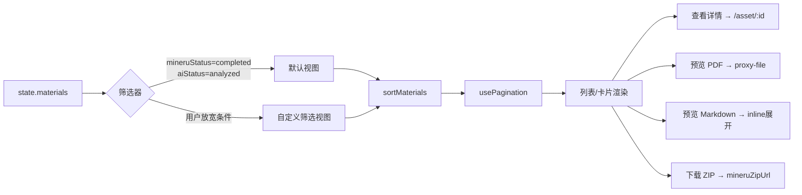

## 用户需求

将当前"成品库"菜单（`/products`）的语义和功能重构为**已处理资料查询库**，展示已完成上传 + MinerU 解析 + AI 元数据识别的第2类资产（MinerU 资产），而非原来的 `Product` 实体。

## 产品概述

"已处理资料库"是资产管理流程的查询检索入口。原始 PDF 上传后经 MinerU 解析和 AI 元数据识别，成为可检索的结构化资产，在此页面集中展示和操作。

## 核心功能

1. **资产列表**：数据源为 `state.materials`，默认展示 `mineruStatus=completed` 且 `aiStatus=analyzed` 的资料，支持放宽条件查看全部已解析资料
2. **多维筛选**：学科、年级、语言、文件类型、MinerU 状态、AI 状态、标签关键字搜索，支持排序（最新上传、名称、文件大小）
3. **原文件操作**：每行/卡片可直接预览原始 PDF / 图片（通过代理 URL），并支持下载
4. **Markdown 预览**：行内展开面板，从 `markdownObjectName` 或 `markdownUrl` 拉取 MinerU 解析的 `full.md`，支持收起/展开，可下载 `.md` 文件
5. **ZIP 下载**：一键下载 MinerU 全量解析产物 ZIP（`mineruZipUrl`）
6. **跳转详情**：点击资料名称或"查看详情"按钮进入 `AssetDetailPage`
7. **导航更名**：侧边栏和顶部导航"成品库"改为"已处理资料库"，路由 `/products` 保持不变

## 技术栈

- React + TypeScript（与项目现有栈一致）
- Tailwind CSS（样式）
- 现有 Store：`useAppStore` → `state.materials` 作为数据源
- 现有工具：`usePagination` / `getPageNumbers`（`src/utils/pagination`）、`sortMaterials`（`src/utils/sort`）
- MinIO 代理 API：`/__proxy/upload/proxy-file`、`/__proxy/upload/presign`（与 AssetDetailPage 保持一致）
- Lucide React 图标库

## 实现思路

### 数据流



### 核心决策

1. **整体重写 `ProductsPage.tsx`**：文件名和路由路径保持不变（避免破坏现有跳转），但内部实现完全替换为 `Material` 语义。`Product` 类型、reducer、DB 层均不触碰。

2. **默认过滤条件**：`mineruStatus === 'completed' && aiStatus === 'analyzed'`，并提供"包含仅 MinerU 完成"的快捷切换 Toggle，方便用户查看 AI 失败但已有 Markdown 的资料。

3. **Markdown 行内展开**：在每行/卡片下方用可折叠 `<div>` 展示，复用 AssetDetailPage 中的 `proxy-file` 拉取逻辑；每个资料的加载状态独立管理（`Map<number, ...>`），避免全局状态污染。

4. **原文件预览**：PDF 使用 `<iframe>` 嵌入代理 URL（`/__proxy/upload/proxy-file?objectName=...`）；图片直接用 ``。弹窗覆盖层实现，与 AssetDetailPage 的 PDFPreviewPanel 逻辑对齐。

5. **分页复用**：直接使用 `usePagination` + `getPageNumbers`，保持和 `SourceMaterialsPage` 一致的体验。

6. **不改动 SourceMaterialsPage**：两个页面定位不同——SourceMaterialsPage 是管理+上传入口（关注流程状态）；ProductsPage 重构后是检索查阅入口（关注内容维度）。

## 实现细节

- **`previewPdf` 状态**：`Map<number, boolean>` 控制哪条资料展开 PDF 预览
- **`mdState` 状态**：`Map<number, { loading: boolean; content: string | null; error: string }>` 控制 Markdown 展开
- **内容截断**：Markdown 超过 20000 字符截断并提示，与 AssetDetailPage 保持一致
- **下载 ZIP**：直接用 `<a href={mineruZipUrl} download>` 触发，mineruZipUrl 为 presigned URL 无需二次代理
- **不影响 DB/reducer**：完全不触碰 `products` 相关代码，`DELETE_PRODUCT`、`ADD_PRODUCT` 动作保留原状
- **布局修改范围最小**：Layout.tsx 仅改两处字符串常量，App.tsx 仅改注释，不改路由定义

## 目录结构

```
src/
├── app/
│   ├── components/
│   │   └── Layout.tsx              # [MODIFY] TOP_NAV/SIDE_NAV 中"成品库"改为"已处理资料库"
│   ├── pages/
│   │   └── ProductsPage.tsx        # [MODIFY] 整体重构：数据源改为 state.materials，新增多维筛选、Markdown行内展开、PDF预览、ZIP下载，移除 Product 相关逻辑
│   └── App.tsx                     # [MODIFY] 路由注释更新，保持 /products 路由不变
```