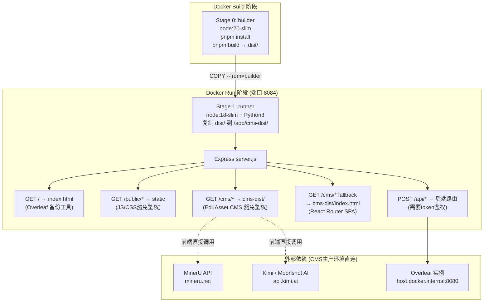

## 用户需求

将 EduAsset CMS（`/workspace/dev/Ui`，React+Vite 项目）集成到 Overleaf 备份管理工具（`/workspace/ops/overleaf_Backup(Ops)`，Express+Docker 项目）中，采用**静态托管集成方案**：

## 产品概述

两套独立工具合并为同一 Docker 容器、同一端口（8084）对外提供服务：

- 访问 `http://mac-mini:8084/` → Overleaf 备份管理工具（原有功能不变）
- 访问 `http://mac-mini:8084/cms/` → EduAsset CMS（React SPA）

## 核心功能

- **Vite 构建配置调整**：为 EduAsset CMS 设置 `base: '/cms/'`，确保资源引用路径在子路径下正确工作
- **Express 静态托管**：Ops 项目 Express 服务新增 `/cms` 静态资源路由，并补充 SPA fallback（`/cms/*` 路径回退到 `/cms/index.html`），让 React Router 客户端路由正常工作
- **鉴权豁免扩展**：将 `/cms/` 路径加入鉴权中间件豁免名单（与 `/public/` 同级），无需 token 即可访问 CMS 静态资源
- **多阶段 Dockerfile 构建**：Stage 1 使用 `node:20` 安装 pnpm 并构建 EduAsset CMS，输出 `dist/`；Stage 2 从 Stage 1 复制构建产物，与 Ops 原有 Node.js + Python 运行时合并为最终镜像
- **docker-compose build context 调整**：将 `build.context` 上调到两个项目的公共祖先目录，让 Dockerfile 可同时访问 Ui 与 Ops 两个子目录

## 技术栈

- **EduAsset CMS**：React 18 + TypeScript + Vite 6 + Tailwind 4 + shadcn/ui（pnpm 管理）
- **Overleaf 备份工具**：Node.js 18 + Express 4 + 原生 HTML/JS（npm 管理）
- **容器化**：Docker 多阶段构建 + docker-compose

## 实现思路

采用 **Docker 多阶段构建 + Express 静态托管** 方案：在 Dockerfile 内新增构建阶段（Builder Stage），使用包含 pnpm 的 Node.js 镜像完成 `vite build`，产出的 `dist/` 被复制到运行阶段的 `/app/cms-dist/` 目录，由 Express `express.static` 托管。React Router 的 SPA 路由依赖 catch-all fallback 实现，鉴权中间件需同步豁免 `/cms/` 路径。

**关键决策说明**：

1. **build context 上调**：两个项目分属不同目录树（`/workspace/dev/Ui` 与 `/workspace/ops/overleaf_Backup(Ops)`），Dockerfile 无法跨 build context 访问。将 `docker-compose.yml` 的 `build.context` 设为公共祖先 `/workspace`，`dockerfile` 路径写绝对子路径，即可在同一 Dockerfile 中 `COPY` 两个项目的内容。

2. **鉴权策略**：CMS 是内网工具，静态资源不需要强鉴权（与 `/public/` 同等豁免），但 CMS 内部调用的外部 API（MinerU、Kimi）已在前端直接带 token，不经过 Ops 后端。

3. **SPA fallback 顺序**：必须在所有 API 路由之后、404 兜底之前注册 `/cms/*` fallback，防止 API 路由被误拦截。

4. **`import.meta.env.DEV` 代理逻辑**：CMS 的 `vite.config.ts` proxy 仅在 `DEV` 模式生效；生产构建后，`SettingsPage.tsx` 和 `SourceMaterialsPage.tsx` 中已有 `if (!import.meta.env.DEV) return rawEndpoint` 分支，直接请求外部 API，无需额外处理。

5. **多阶段镜像**：Builder stage 仅用于构建，不进入最终镜像，保持镜像体积可控。pnpm 通过 `npm install -g pnpm` 安装，复用现有国内镜像加速配置。

## 实现细节

- **`vite.config.ts`**：只需加 `base: '/cms/'`，其余配置（proxy、alias、assetsInclude）完全不变；proxy 仅开发期有效，生产构建不影响。
- **`auth.js`**：在现有 `if (req.path.startsWith('/public/')) return next()` 后增加一行 `if (req.path.startsWith('/cms/')) return next()`，最小改动。
- **`server.js`**：在 `app.get('/')` 后、API 路由前注册 `/cms` 静态路由；在 404 兜底前注册 SPA fallback：`app.get('/cms/*', (req, res) => res.sendFile(path.join(CMS_DIST, 'index.html')))`。
- **`Dockerfile`**：新增 Stage 0（builder），`FROM node:20-slim AS builder`，`COPY` Ui 目录，安装 pnpm，执行 `pnpm install --frozen-lockfile && pnpm build`；Stage 1 继承现有逻辑，末尾增加 `COPY --from=builder /build/cms-dist /app/cms-dist`。
- **`docker-compose.yml`**：`build.context` 改为 `../../`（相对于 compose 文件位置，指向 `/workspace`），`build.dockerfile` 写为 `ops/overleaf_Backup(Ops)/Dockerfile`（或调整为绝对路径引用）。

## 架构设计



## 目录结构

```
/workspace/                               ← docker-compose build context（上调）
├── dev/
│   └── Ui/
│       └── vite.config.ts                # [MODIFY] 新增 base: '/cms/'
└── ops/
    └── overleaf_Backup(Ops)/
        ├── Dockerfile                    # [MODIFY] 新增 Stage 0 builder 阶段，COPY Ui 源码并构建
        ├── docker-compose.yml            # [MODIFY] build.context 上调到 /workspace（../../）
        └── DuplicateReplace/
            ├── server.js                 # [MODIFY] 新增 /cms 静态路由 + SPA fallback
            └── utils/
                └── auth.js               # [MODIFY] 豁免 /cms/ 路径鉴权
```