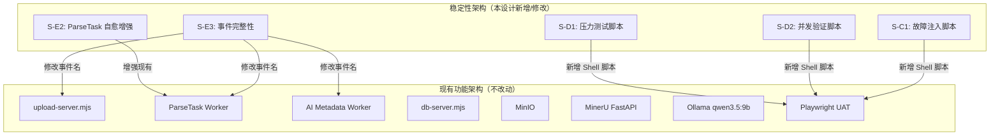
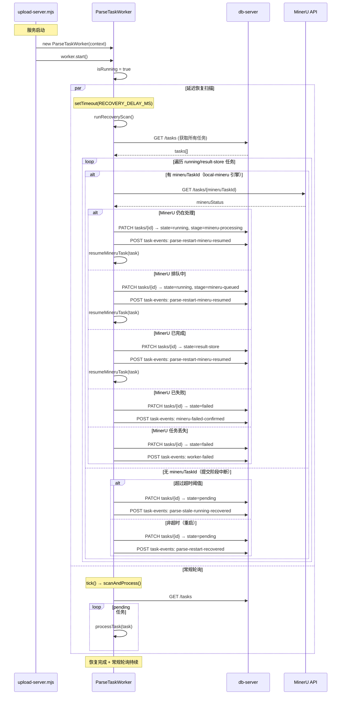
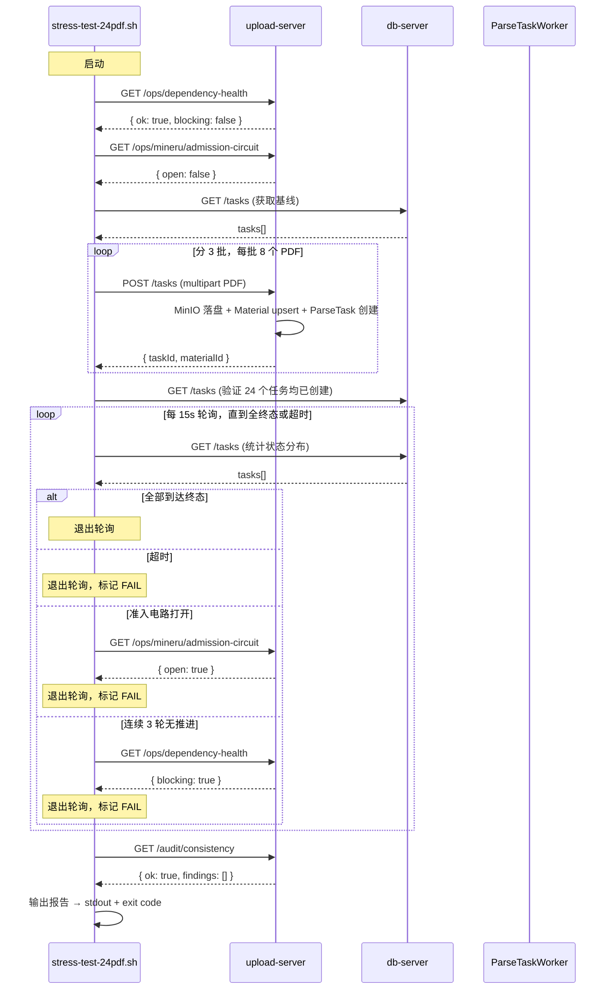

# Luceon2026 稳定性架构设计 v0.2

- 文档版本：v0.2（v0.1 基础上增补 AI Worker 可观测增强 + MinerU 日志活性判定 + 测试修复 + 压力测试结果）
- 发布日期：2026-05-11
- 作者：高见远（Gao）· 架构师
- 输入文档：[Luceon2026 稳定性 PRD v0.1](../prd/Luceon2026-Stability-PRD-v0.1.md)
- 配套文档：[Luceon2026 功能 PRD v0.4](../prd/Luceon2026-PRD-v0.4.md)
- 适用范围：Phase 1 稳定性收尾阶段的架构设计与任务分解

### 变更记录

| 版本 | 日期 | 变更内容 |
| :--- | :--- | :--- |
| v0.1 | 2026-05-11 | 初始架构设计，涵盖 T-S01~T-S10 |
| v0.2 | 2026-05-11 | 增补 AI Worker 可观测性增强（方案 A-E）、MinerU 日志活性健康判定、测试脚本修复清单、24-PDF 压测结果 |

---

## 目录

1. [架构总览](#1-架构总览)
2. [核心模块设计](#2-核心模块设计)
   - [2.1 ParseTask Worker 自愈机制](#21-parsetask-worker-自愈机制)
   - [2.2 压力测试工具](#22-压力测试工具)
   - [2.3 故障注入测试](#23-故障注入测试)
3. [文件列表及相对路径](#3-文件列表及相对路径)
4. [数据结构和接口](#4-数据结构和接口)
5. [程序调用流程（时序图）](#5-程序调用流程时序图)
6. [任务列表](#6-任务列表)
7. [依赖包列表](#7-依赖包列表)
8. [共享知识（跨文件约定）](#8-共享知识跨文件约定)
9. [待明确事项](#9-待明确事项)
10. [v0.2 增补 — AI Worker 可观测性增强](#10-v02-增补--ai-worker-可观测性增强)
11. [v0.2 增补 — MinerU 日志活性健康判定](#11-v02-增补--mineru-日志活性健康判定)
12. [v0.2 增补 — 测试脚本修复清单](#12-v02-增补--测试脚本修复清单)
13. [v0.2 增补 — 压力测试结果](#13-v02-增补--压力测试结果)

---

## 1. 架构总览

### 1.1 稳定性架构与功能架构的关系

稳定性改造以**最小侵入**方式嵌入现有功能架构，核心原则：

1. **不更改现有数据模型**：只追加事件类型枚举值
2. **不更改现有 API 语义**：PATCH `/tasks/:id` 已支持状态回写
3. **不引入新的外部依赖**：Shell 脚本 + 现有 Playwright 框架
4. **复用现有模式**：AI Worker 的 stale-recovery 模式作为 ParseTask 恢复的设计参考



### 1.2 需修改/新增的模块清单

| 模块 | 类型 | 说明 |
| :--- | :--- | :--- |
| `server/services/queue/task-worker.mjs` | 修改 | 自愈事件命名对齐 PRD |
| `server/services/ai/metadata-worker.mjs` | 修改 | 降低 Strict 超时 300000→180000；stale-recovery 后立即处理下一个 pending job |
| `server/services/ai/providers/ollama.mjs` | 修改 | 新增心跳日志 + 超时分级 + 首字节超时（方案 A/B/E） |
| `server/services/mineru/local-adapter.mjs` | 修改 | 新增轮询/接管路径中的日志活性健康判定 |
| `uat/stress-test-24pdf.sh` | 新建 | 24-PDF 批量压力测试 |
| `uat/stress-test-concurrency.sh` | 新建 | 5+ 并发阶段排队验证 |
| `uat/fault-injection-admission.sh` | 新建 | 准入电路故障注入验证 |
| `uat/fault-injection-worker-crash.sh` | 新建 | Worker 异常终止模拟 |
| `docs/design/Luceon2026-Stability-Architecture-v0.1.md` | 新建 | 本文档 |

---

## 2. 核心模块设计

### 2.1 ParseTask Worker 自愈机制

#### 2.1.1 当前状态分析

`task-worker.mjs` 已实现启动恢复扫描 `runRecoveryScan()`，功能覆盖如下：

| 恢复场景 | 当前实现 | SM 匹配还原 | 事件记录 |
| :--- | :--- | :--- | :--- |
| MinerU 仍在处理中 | `state=running, stage=mineru-processing` → 接管 | 是 | 否 |
| MinerU 在排队 | `state=running, stage=mineru-queued` → 接管 | 是 | 否 |
| MinerU 已完成 | `state=result-store` → 拉取结果 | 是 | 否 |
| MinerU 已失败 | `state=failed` → 同步失败 | 是 | `mineru-failed-confirmed` |
| MinerU 404 | `state=failed` → 标记丢失 | 是 | `worker-failed` |
| running 超过超时阈值 | `state=pending` → 重新排队 | 是 | `stale-running-recovered` |
| 非超时 running（重启） | `state=pending` → 重新排队 | 是 | `restart-recovered` |

**差距分析**：

1. **事件命名不一致**：PRD 要求 `parse-stale-running-recovered`，当前使用 `stale-running-recovered`
2. **pending 任务补偿调度**：当前 `runRecoveryScan()` 仅扫描 `running`/`result-store`，但正常 `tick()` 循环会在恢复扫描后立即拾取所有 `pending` 任务
3. **恢复事件缺失部分场景**：MinerU 接管场景（processing/queued/completed）未记录事件

#### 2.1.2 改造方案

**最小变更方案**：仅修改事件名称，使其与 PRD 一致。pending 补偿调度由现有 `tick()` 循环自然覆盖。

```javascript
// task-worker.mjs runRecoveryScan() 中的事件修改

// 修改前（line ~352-361）:
await logTaskEvent({
  taskId: task.id,
  taskType: 'parse',
  level: 'warn',
  event: isExplicitlyStale ? 'stale-running-recovered' : 'restart-recovered',
  message: ...,
  payload: { previousState: task.state, previousUpdatedAt: task.updatedAt },
});

// 修改后:
await logTaskEvent({
  taskId: task.id,
  taskType: 'parse',
  level: 'warn',
  event: isExplicitlyStale ? 'parse-stale-running-recovered' : 'parse-restart-recovered',
  message: isExplicitlyStale
    ? '检测到卡住的解析任务（updatedAt 超过 localTimeout + 60s 缓冲），已自动重置为 pending'
    : '检测到服务重启前的运行中任务，已重置为 pending 等待重新拾取',
  payload: {
    previousState: task.state,
    previousUpdatedAt: task.updatedAt,
    recoveryTrigger: isExplicitlyStale ? 'stale-timeout' : 'restart',
    staleCheck: isExplicitlyStale ? {
      updatedAt: task.updatedAt,
      timeoutMs: Number(task.optionsSnapshot?.localTimeout || 3600) * 1000,
      gracePeriodMs: STALE_GRACE_MS,
    } : undefined,
  },
});
```

**增强方案（可选）**：为 MinerU 接管场景补充事件记录，提升可观测性。

```javascript
// 在 runRecoveryScan() 中各接管分支追加事件记录
// 以 MinerU 仍在处理为例（line ~245-251 之后追加）:
await logTaskEvent({
  taskId: task.id,
  taskType: 'parse',
  level: 'info',
  event: 'parse-restart-mineru-resumed',
  message: `重启恢复：检测到 MinerU 仍在处理 (${mineruTaskId})，已接管`,
  payload: {
    mineruTaskId,
    mineruStatus,
    previousState: task.state,
    newState: 'running',
  },
});
```

#### 2.1.3 超时阈值计算

```javascript
// 超时阈值 = optionsSnapshot.localTimeout * 1000 ms + STALE_GRACE_MS (60s)
// 
// 代码已有读取逻辑（task-worker.mjs line 338）:
const timeoutMs = Number(task.optionsSnapshot?.localTimeout || 3600) * 1000;
const isExplicitlyStale = updatedAt > 0 && (now - updatedAt) > (timeoutMs + STALE_GRACE_MS);
```

#### 2.1.4 与 AI Worker stale-recovery 的语义对齐

| 维度 | AI Worker | ParseTask Worker（改造后） |
| :--- | :--- | :--- |
| 扫描范围 | `state=running` jobs | `state ∈ {running, result-store}` tasks |
| 超时阈值 | `defaultTimeoutMs + 60s` | `optionsSnapshot.localTimeout + 60s` |
| 恢复动作 | 重置为 `pending` | 重置为 `pending`（非超时）或接管 MinerU |
| 事件名称 | `ai-stale-running-recovered` | `parse-stale-running-recovered` |
| 去重机制 | 进程级 `_staleRecoveredJobIds` Set | 无（每次重启后首次扫描） |

---

### 2.2 压力测试工具

#### 2.2.1 设计决策

**选择：独立 Shell 脚本**（兼容现有 `smoke-test.sh` 风格）

理由：
- 不依赖 Playwright/Node.js 运行时
- 可利用 `curl` 直接发起 multipart 上传
- 输出格式与现有冒烟测试一致（彩色 PASS/FAIL）
- Playwright 更适合前端 UI 验证，Shell 更适合 API 压测

#### 2.2.2 24-PDF 批量压力测试脚本

**文件路径**：`uat/stress-test-24pdf.sh`

```
输入参数：
  BASE_URL          - 目标服务地址（默认 http://127.0.0.1:8081）
  TEST_PDF_DIR      - 样本 PDF 目录（默认 ../testpdf）
  CONCURRENT_BATCH  - 每批并发数（默认 8）
  BATCH_INTERVAL    - 批次间隔秒数（默认 10）
  MAX_WAIT_MINUTES  - 最大等待分钟数（默认 60）
  POLL_INTERVAL     - 状态轮询间隔秒（默认 15）

执行流程：
  1. 预检：dependency-health 全绿 + MinerU submit-probe pass + 准入电路关闭
  2. 获取基线：GET /tasks 记录已存在任务数
  3. 分 3 批提交 24 个 PDF（每批 8 个，间隔 10s）
  4. 轮询：每 15s 查询 GET /tasks 统计终态任务数
  5. 停止条件：所有任务到达终态 或 超时
  6. 输出报告：
     - 创建成功率（≥ 24）
     - 终态分布（completed / review-pending / failed / canceled）
     - ≥ 80% 到达终态判定（PASS/FAIL）
     - 各任务耗时分布（P50/P95/Max）
     - 一致性审计结果 (GET /audit/consistency)
```

**输出示例**：

```
============================================================
  Luceon2026 24-PDF 压力测试
  目标地址：http://127.0.0.1:8081
  样本目录：../testpdf
  时间：2026-05-11 15:30:00
============================================================

【1】预检
  ✓ dependency-health 全绿
  ✓ MinerU submit-probe 通过
  ✓ 准入电路已关闭

【2】批量提交 (24 个 PDF)
  批次 1/3: 提交 8 个... ✓ (8/8 创建成功)
  批次 2/3: 提交 8 个... ✓ (8/8 创建成功)
  批次 3/3: 提交 8 个... ✓ (8/8 创建成功)
  总计：24/24 任务创建成功

【3】终态等待 (最大 60min)
  [15s] 24 个活跃: completed=0, review-pending=0, processing=24
  [30s] 24 个活跃: completed=0, review-pending=0, processing=24
  ...
  [5min] 12 个活跃: completed=3, review-pending=0, processing=19, failed=2
  [6min] 0 个活跃: completed=20, review-pending=2, failed=2

【4】结果统计
  创建任务: 24
  到达终态: 22 (91.7%)
  ────────────────────────
  终态分布:
    completed:        20 (83.3%)
    review-pending:    2  (8.3%)
    failed:            2  (8.3%)
    canceled:          0  (0.0%)
  处理中:             0  (0.0%)

【5】耗时分布
  P50: 245s  P95: 312s  Max: 340s

【6】一致性审计
  GET /audit/consistency: ok=true, findings=0

============================================================
  结果：✓ PASS（到达终态 ≥ 80%）
  通过条件：22/24 ≈ 91.7% ≥ 80%
============================================================
```

#### 2.2.3 停止条件处理

| 停止条件 | 判定逻辑 | 测试结果 |
| :--- | :--- | :--- |
| 全部到达终态 | `remainingActive == 0` | PASS 或 FAIL（根据比率） |
| 超时 | `elapsed > MAX_WAIT_MINUTES` | FAIL（输出未完成列表） |
| 准入电路打开 | `GET /ops/mineru/admission-circuit` 返回 open=true | FAIL（输出电路状态） |
| 503 响应 | POST /tasks 返回 503 | FAIL（输出 MINERU_ADMISSION_CIRCUIT_OPEN） |
| dependency blocked | 连续 3 轮轮询无终态推进 + dependency-health blocking=true | FAIL（输出 blocked 依赖） |

#### 2.2.4 5+ 并发阶段排队验证脚本

**文件路径**：`uat/stress-test-concurrency.sh`

与 24-PDF 脚本结构相似，差异如下：

- 提交 5 个 Markdown + 5 个小 PDF（共 10 个文件）
- 并发提交（非批次间隔）
- 验证点：
  1. upload/storage 持久化后即可接受下一个上传（检查任务创建时间间隔 < 5s）
  2. MinerU heavy-stage 同一时刻仅 1 个任务处于 running（检查 `/ops/mineru/active-task`）
  3. AI Worker active count ≤ 1（检查 `/ops/mineru/diagnostics` 的 `aiRunning` 计数）
  4. 所有任务在 10 分钟内到达终态

---

### 2.3 故障注入测试

#### 2.3.1 准入电路故障注入

**文件路径**：`uat/fault-injection-admission.sh`

```
故障注入方式：
  - 模拟 MinerU submit-path 不可用：
    在提交 PDF 前停止 MinerU FastAPI 服务
  - 模拟半故障（/health OK, submit 500）：
    使用 MinerU mock（返回 /health=200, POST /tasks=500）

验证点：
  1. 故障注入后 POST /tasks 返回 503 MINERU_ADMISSION_CIRCUIT_OPEN
  2. Markdown 上传不受影响
  3. 电流 PDF 保持 dependency-blocked
  4. 恢复 MinerU 后仅 /health 恢复：电路保持打开
  5. submit-probe 成功后：电路在 cooldown 期内关闭
  6. 电路关闭后 PDF 上传恢复正常

执行方式：
  # 测试 1：完全停止 MinerU
  bash uat/fault-injection-admission.sh --mode mineru-down
  
  # 测试 2：半故障（mock）
  bash uat/fault-injection-admission.sh --mode mineru-half-failure
  
  # 测试 3：恢复验证
  bash uat/fault-injection-admission.sh --mode recovery
```

#### 2.3.2 Worker 异常终止模拟

**文件路径**：`uat/fault-injection-worker-crash.sh`

```
故障注入方式：
  1. 提交一个 PDF 任务，等待进入 running 状态
  2. 强制终止 upload-server 进程 (docker kill upload-server)
  3. 重启 upload-server (docker compose up -d upload-server)
  
验证点：
  1. ParseTask Worker 启动后执行恢复扫描
  2. running 中的任务被重置为 pending
  3. parse-stale-running-recovered 事件被记录
  4. 任务重新被拾取并完成整个流程
  5. 若 MinerU 中任务仍在处理，自动接管

执行方式：
  bash uat/fault-injection-worker-crash.sh
```

---

## 3. 文件列表及相对路径

### 3.1 新建文件

| 文件路径 | 用途 |
| :--- | :--- |
| `uat/stress-test-24pdf.sh` | 24-PDF 批量压力测试脚本 |
| `uat/stress-test-concurrency.sh` | 5+ 并发阶段排队验证脚本 |
| `uat/fault-injection-admission.sh` | 准入电路故障注入验证脚本 |
| `uat/fault-injection-worker-crash.sh` | Worker 异常终止自愈验证脚本 |
| `uat/lib/test-utils.sh` | 测试公共工具函数（轮询、报告格式化、预检） |
| `docs/design/Luceon2026-Stability-Architecture-v0.1.md` | 本文档 |

### 3.2 修改现有文件

| 文件路径 | 变更内容 | 影响范围 |
| :--- | :--- | :--- |
| `server/services/queue/task-worker.mjs` | 事件名 `stale-running-recovered` → `parse-stale-running-recovered`；`restart-recovered` → `parse-restart-recovered`；为 MinerU 接管场景补充事件 | ~20 行变更 |
| `server/upload-server.mjs` | 无修改（已有 `/tasks` 创建、`/tasks` 查询、`/audit/consistency` 端点） | 无 |
| `server/services/ai/metadata-worker.mjs` | Strict 超时 300000→180000；stale-recovery 后立即处理下一个 pending job | ~5 行变更 |
| `server/services/ai/providers/ollama.mjs` | 新增心跳日志 + 超时分级（Phase1/2/3）；undici Agent `headersTimeout=30000` | ~40 行新增 |
| `server/services/mineru/local-adapter.mjs` | 新增轮询/接管路径中的日志活性健康判定（双重条件：activityLevel + logAgeMs） | ~30 行新增 |
| `uat/README.md` | 补充压力测试和故障注入脚本的使用说明 | ~30 行新增 |

---

## 4. 数据结构和接口

### 4.1 新增事件类型枚举

以下事件类型需在 `taskEvents` 模型中注册：

| 事件类型 | 触发场景 | 级别 | 写入方 |
| :--- | :--- | :--- | :--- |
| `parse-stale-running-recovered` | ParseTask 超过 localTimeout + 60s 仍为 running，重置为 pending | `warn` | `task-worker.mjs` |
| `parse-restart-recovered` | 服务重启后 running/result-store 任务重置为 pending | `warn` | `task-worker.mjs` |
| `parse-restart-mineru-resumed` | 重启后检测到 MinerU 仍在处理，接管任务 | `info` | `task-worker.mjs` |

**与现有事件的关系**：

```javascript
// 事件注册表（在 task-events.mjs 或 db-server 中维护）
const KNOWN_EVENTS = new Set([
  // 现有事件（不变）
  'task-created', 'mineru-started', 'mineru-completed', 'result-stored',
  'ai-provider-request-started', 'ai-provider-request-succeeded', 'ai-provider-request-failed',
  'ai-content-truncated', 'ai-stale-running-recovered', 'ai-skeleton-fallback',
  'ai-provider-repair-succeeded', 'ai-provider-repair-failed', 'ai-provider-repair-retry-started',
  'ai-provider-repair-retry-succeeded', 'ai-provider-repair-retry-failed',
  'ai-provider-repair-deterministic-succeeded',
  'retry-requested', 'consistency-checked', 'progress-update',
  'mineru-failed-confirmed', 'worker-failed',
  'restart-recovered', 'stale-running-recovered',  // 将被替换或保留兼容
  // 新增事件
  'parse-stale-running-recovered',
  'parse-restart-recovered',
  'parse-restart-mineru-resumed',
]);
```

### 4.2 压力测试脚本输入/输出 Schema

#### 输入（环境变量 + 参数）

```bash
# 环境变量
BASE_URL="http://127.0.0.1:8081"      # 目标服务地址
TEST_PDF_DIR="../testpdf"             # 样本 PDF 目录
CONCURRENT_BATCH=8                     # 每批并发提交数
BATCH_INTERVAL=10                      # 批次间隔（秒）
MAX_WAIT_MINUTES=60                    # 最大等待时间（分钟）
POLL_INTERVAL=15                       # 状态轮询间隔（秒）
VERBOSE=false                          # 是否输出详细日志
```

#### 输出（stdout + 退出码）

```json
{
  "test": "stress-test-24pdf",
  "timestamp": "2026-05-11T15:30:00Z",
  "result": "PASS",
  "summary": {
    "total_submitted": 24,
    "created": 24,
    "submit_failed": 0,
    "reached_terminal": {
      "completed": 20,
      "review_pending": 2,
      "failed": 2,
      "canceled": 0,
      "total": 22
    },
    "terminal_rate": 0.917,
    "threshold": 0.8,
    "threshold_met": true
  },
  "timing": {
    "p50_seconds": 245,
    "p95_seconds": 312,
    "max_seconds": 340
  },
  "consistency_audit": {
    "ok": true,
    "findings": []
  },
  "stop_reason": "all_terminal",
  "exit_code": 0
}
```

### 4.3 无需新增 API 端点

所有验证均使用现有 API：

| API | 用途 | 使用方 |
| :--- | :--- | :--- |
| `POST /__proxy/upload/tasks` | 提交 PDF/Markdown | 压力测试脚本 |
| `GET /__proxy/upload/ops/dependency-health` | 预检依赖就绪状态 | 压力测试脚本 |
| `GET /__proxy/upload/ops/mineru/admission-circuit` | 检查准入电路状态 | 压力测试 + 故障注入脚本 |
| `GET /__proxy/db/tasks` | 查询任务状态 | 压力测试脚本 |
| `GET /__proxy/upload/audit/consistency` | 一致性审计 | 压力测试脚本 |
| `GET /__proxy/db/task-events?taskId=xxx` | 查询事件日志 | 故障注入脚本 |

---

## 5. 程序调用流程（时序图）

### 5.1 ParseTask Worker 启动恢复流程



### 5.2 压力测试执行流程



---

## 6. 任务列表

任务按实现顺序排列，含依赖关系。

### 6.1 P0 任务（阻断项，必须先完成）

```
- 任务编号: T-S01
- 任务名称: ParseTask Worker 自愈事件命名对齐 PRD
- 依赖: []
- 涉及文件:
    server/services/queue/task-worker.mjs
- 验收标准:
    1. 启动时 running 任务超过 localTimeout + 60s 重置为 pending
    2. 事件类型为 parse-stale-running-recovered（含 payload 含 timeoutMs/gracePeriodMs）
    3. 重启恢复事件为 parse-restart-recovered
    4. MinerU 接管事件为 parse-restart-mineru-resumed
    5. 查询 GET /task-events?taskId=xxx 可看到上述事件
- 预估工作量: S
```

```
- 任务编号: T-S02
- 任务名称: 24-PDF 压力测试脚本
- 依赖: [T-S01]
- 涉及文件:
    uat/lib/test-utils.sh（新建）
    uat/stress-test-24pdf.sh（新建）
- 验收标准:
    1. 在 MinerU 和 Ollama 均就绪时执行脚本
    2. 24 个 PDF 全部提交成功（ParseTask 入库）
    3. ≥ 80% 任务到达 review-pending 或 completed
    4. 无一任务静默丢失（状态永不更新）
    5. 输出报告含终态分布和耗时分布
    6. 停止条件正确触发（全终态 / 超时 / 电路打开）
- 预估工作量: M
```

```
- 任务编号: T-S03
- 任务名称: 5+ 并发阶段排队验证脚本
- 依赖: [T-S02]
- 涉及文件:
    uat/stress-test-concurrency.sh（新建）
- 验收标准:
    1. 快速连续提交 5 个 Markdown + 5 个 PDF
    2. upload/storage 持久化后即可接受下一个上传（间隔 < 5s）
    3. MinerU heavy-stage active count ≤ 1
    4. AI Worker active count ≤ 1
    5. 所有任务在 10 分钟内到达终态
- 预估工作量: M
```

```
- 任务编号: T-S04
- 任务名称: ParseTask Worker 自愈故障注入验证脚本
- 依赖: [T-S01]
- 涉及文件:
    uat/fault-injection-worker-crash.sh（新建）
- 验收标准:
    1. 提交 PDF 后等待进入 running 状态
    2. 强制终止 upload-server 后重启
    3. 验证 running 中的任务被重置为 pending
    4. 验证 parse-stale-running-recovered 事件被记录
    5. 验证任务最终完成完整流程（到达 review-pending/completed）
- 预估工作量: M
```

### 6.2 P1 任务（高风险项）

```
- 任务编号: T-S05
- 任务名称: 准入电路故障注入验证脚本
- 依赖: []
- 涉及文件:
    uat/fault-injection-admission.sh（新建）
- 验收标准:
    1. 停止 MinerU 后 POST /tasks 返回 503
    2. Markdown 上传不受影响
    3. MinerU 半故障（/health OK, submit 500）场景下电路正确打开
    4. 仅 /health 恢复时电路保持打开
    5. submit-probe 成功后电路在 cooldown 后关闭
    6. 电路关闭后 PDF 上传恢复正常
- 预估工作量: M
```

```
- 任务编号: T-S06
- 任务名称: Ollama keep-alive 压测验证
- 依赖: [T-S01]
- 涉及文件:
    uat/stress-test-24pdf.sh（复用）
- 验收标准:
    1. 在 24-PDF 压力测试中，keep-alive 连接持续维持 ≥ 30 分钟
    2. dependency-health 正确区分冷/热状态
    3. 热状态下 P95 响应时间 < 2s
- 预估工作量: S
```

```
- 任务编号: T-S07
- 任务名称: MinerU submit-probe 连续验证
- 依赖: []
- 涉及文件:
    uat/fault-injection-admission.sh（复用）
- 验收标准:
    1. 在 MinerU 正常运行下连续 3 次 submit-probe 均通过
    2. 在 MinerU 半故障下连续 3 次 submit-probe 均失败
    3. 输出明确的 probe 结果报告
- 预估工作量: S
```

```
- 任务编号: T-S08
- 任务名称: 更新 UAT README
- 依赖: [T-S02, T-S03, T-S04, T-S05]
- 涉及文件:
    uat/README.md
- 验收标准:
    1. 文档包含所有新建脚本的使用说明
    2. 文档包含环境变量说明
    3. 文档包含预期输出示例
- 预估工作量: S
```

### 6.3 P2 任务（可搁置）

```
- 任务编号: T-S09
- 任务名称: 压力测试报告 CI 集成（GitHub Actions / pre-commit hook）
- 依赖: [T-S02, T-S03]
- 涉及文件:
    .github/workflows/stress-test.yml（新建，可选）
- 验收标准:
    1. 每次 push 到 main 时自动运行压力测试
    2. 失败时发送通知
- 预估工作量: M
```

```
- 任务编号: T-S10
- 任务名称: upload-server.mjs 架构拆分（P2 非本次交付）
- 依赖: []
- 涉及文件:
    server/upload-server.mjs
    server/routes/（新建）
- 验收标准:
    待 Phase 2 定义
- 预估工作量: L
```

---

## 7. 依赖包列表

**无需新增 npm 依赖**。所有改动基于现有技术栈：

| 用途 | 现有工具 | 备注 |
| :--- | :--- | :--- |
| HTTP 请求 | `curl`（系统自带） | 压力测试脚本 |
| JSON 解析 | `jq`（`brew install jq` 或系统自带） | 压力测试脚本 |
| 浏览器自动化 | Playwright（`uat/package.json`） | UAT 已有 |
| 进程管理 | `docker compose` | 已有 |
| MinIO 客户端 | `minio` npm 包（`upload-server.mjs`） | 已有 |
| Express 路由 | `express` npm 包 | 已有 |

> 注意：`jq` 可能需要操作员手动安装（macOS 已预装，Ubuntu 需 `apt install jq`，Windows Git Bash 已包含）。脚本中会做存在性检查。

---

## 8. 共享知识（跨文件约定）

### 8.1 事件类型命名约定

```
格式：{domain}-{action}-{result}

domain:
  parse    - 解析阶段事件
  ai       - AI 识别阶段事件
  task     - 通用任务事件

action:
  stale-running  - 僵尸任务检测
  restart        - 服务重启
  mineru         - MinerU 相关
  *-recovered   - 恢复动作
  *-failed      - 失败动作
  *-succeeded   - 成功动作

示例:
  parse-stale-running-recovered  (ParseTask 超时重置)
  parse-restart-recovered        (重启后恢复)
  parse-restart-mineru-resumed   (重启后接管 MinerU)
  ai-stale-running-recovered     (AI Job 超时重置，已有)
```

### 8.2 超时常量定义

```javascript
// task-worker.mjs
const POLL_INTERVAL_MS = 10000;          // 轮询间隔
const STALE_GRACE_MS = 60000;            // stale-recovery 缓冲期
const RECOVERY_DELAY_MS = 2000;          // 启动后延迟扫描
const MAX_CONCURRENT_TASKS = 1;          // 最大并发处理数

// metadata-worker.mjs
const GRACE_PERIOD_MS = 60000;           // AI stale-recovery 缓冲期
const defaultTimeoutMs = 300000;         // Strict 模式超时（5min → v0.2 降至 180000）
// const defaultTimeoutMs = 120000;      // 非 Strict 模式超时（2min）

// metadata-worker.mjs — v0.2 更新
// timeoutMs: STRICT_NO_SKELETON ? 180000 : 120000 (由 300000 降低)

// 压力测试脚本
const DEFAULT_MAX_WAIT_MINUTES = 60;
const DEFAULT_POLL_INTERVAL_SECONDS = 15;
const DEFAULT_BATCH_INTERVAL_SECONDS = 10;
const DEFAULT_CONCURRENT_BATCH_SIZE = 8;
```

### 8.3 测试样本管理约定

```
目录结构：
  testpdf/                          ← 压力测试样本 PDF 目录
    ├── sample-001.pdf              ← 小 PDF（< 5MB, < 10 pages）
    ├── sample-002.pdf
    ├── ...
    └── sample-024.pdf              ← 至少 24 个样本

  testmd/                           ← 并发测试样本 Markdown 目录
    ├── sample-001.md
    ├── ...
    └── sample-010.md

  uat/                              ← 脚本目录
    ├── stress-test-24pdf.sh        ← 24-PDF 压力测试
    ├── stress-test-concurrency.sh  ← 并发测试
    ├── fault-injection-admission.sh← 准入电路故障注入
    ├── fault-injection-worker-crash.sh ← Worker 异常终止
    └── lib/test-utils.sh           ← 公共函数

规则：
  1. 样本文件不得包含敏感内容
  2. 样本文件应覆盖多种大小（1MB - 20MB）
  3. 压力测试前样本目录必须存在且至少包含所需数量的文件
  4. 测试脚本不得修改样本文件
```

---

## 9. 待明确事项

以下事项需要 Director 确认：

| 编号 | 问题 | 建议方案 | 优先级 |
| :--- | :--- | :--- | :--- |
| Q-01 | 事件名 `parse-stale-running-recovered` vs 保留 `stale-running-recovered`？ | 建议统一为 `parse-stale-running-recovered`，与 AI 的 `ai-stale-running-recovered` 形成命名组 | 高 |
| Q-02 | 是否需要为 MinerU 接管场景补充事件？当前代码中这些场景仅做状态重写无事件记录 | 建议补充，提升可观测性（已在增强方案中设计） | 中 |
| Q-03 | 压力测试脚本是否需要作为 CI pipeline 的一部分？ | 建议先在本地手动执行，Phase 2 评估 CI 集成 | 低 |
| Q-04 | `jq` 依赖是否可接受？部分 Linux 发行版默认不含 `jq` | 可在脚本中自动检查并提示安装；或用 Node.js 替代 | 低 |
| Q-05 | 压力测试样本目录（`testpdf/`）是否需要纳入版本管理？ | 建议 `.gitignore` 排除，由操作员自行准备样本 | 低 |
| Q-06 | `runRecoveryScan()` 是否需要在正常 `tick()` 之前执行完毕？ | 当前设计为并行执行（recovery scan 延迟 2s，tick 立即开始），已覆盖 pending 补偿 | 低 |
| Q-07 | T-S10（upload-server 拆分）是否纳入本次交付？ | 稳定性 PRD 明确此为 P2，本次不实施 | 已确认 |

---

## 10. v0.2 增补 — AI Worker 可观测性增强

### 10.1 问题背景

AI Metadata Worker (`metadata-worker.mjs`) 在调用 Ollama 推理时面临三类可观测性盲区：

1. **静默卡死**：Ollama 推理长时间无响应时，worker 在 `AbortSignal.timeout()`（原 300s）到期前完全静默，操作员无法判断是正常慢推理还是已卡死
2. **首字节超时缺失**：`fetch()` 默认无首字节超时，Ollama 进程挂死后 TCP 连接可能长时间不报错
3. **恢复后饥饿**：`recoverStaleRunningJobs()` 释放 pending job 后，下一次 `tick()` 才轮到该 job，存在一轮轮询延迟

### 10.2 方案概览

五方案组成递进式可观测链，覆盖从连接建立到推理完成的完整生命周期：

```
方案 A（心跳日志）        方案 B（首字节超时）      方案 C（卡住跳过）
   ↓                         ↓                        ↓
推理开始 → 10s级 console.log  → 30s 内收不到响应头 → stale-recovery 后
   ↓        持续可观测          立即断连报错          立即处理 pending job
方案 D（减小超时）       方案 E（超时分级）       
   ↓                         ↓                      
180s 总超时           Phase1(0-60s)心跳→Phase2(60-120s)warn→Phase3(>120s)主动 ping
```

### 10.3 技术实现要点

**方案 A — 心跳日志**（`ollama.mjs:58-89`）

```javascript
const heartbeatInterval = setInterval(() => {
  const elapsed = Math.round((Date.now() - startTime) / 1000);
  if (elapsed <= 60) {
    console.log(`[ai-worker] Ollama ${this.model} 推理中... (已等待 ${elapsed}s)`);
  }
  // ...
}, 10000);
```

每 10s 输出进度日志，操作员可从日志流确认 worker 存活。

**方案 B — 首字节超时**（`ollama.mjs:91-94`）

```javascript
const dispatcher = new Agent({
  headersTimeout: 30000,   // 30s 内必须收到响应头
  bodyTimeout: this.timeoutMs
});
```

使用 undici `Agent` 配置 `headersTimeout=30000`，30s 内收不到 HTTP 响应头即断连，短于 Ollama 默认 TCP keepalive（通常 ~75s），可快速检测 Ollama 进程挂死。

**方案 C — 卡住跳过**（`metadata-worker.mjs:143-160`）

`recoverStaleRunningJobs()` 执行后，立即再次 `getAllJobs()` 并检查是否有恢复后立即可用的 `pending` job，如果有则直接调用 `processJob()`，无需等待下一次 `tick()`。

**方案 D — 减小 Strict 超时**（`metadata-worker.mjs:526`）

```javascript
timeoutMs: STRICT_NO_SKELETON ? 180000 : 120000
// 原值: 300000 (5min)
```

Strict 模式下超时从 300s 降至 180s，与 Ollama 默认 `num_predict=1024` 配合，正常推理通常在 30~90s 完成，180s 提供充足余量。

**方案 E — 超时分级**（`ollama.mjs:62-88`）

| 阶段 | 时间窗口 | 动作 | 日志级别 |
| :--- | :--- | :--- | :--- |
| Phase 1 | 0-60s | 每 10s 输出 `console.log` 心跳 | info |
| Phase 2 | 60-120s | 输出 `console.warn` 响应缓慢 | warn |
| Phase 3 | >120s | 每 30s 主动 ping `GET /api/tags`（5s 超时），按结果分级输出 | warn/error |

### 10.4 信号链：操作员可观测的完整时序

```
T+0s    → [ai-worker] Picking job: xxx
T+10s   → [ai-worker] Ollama qwen3.5:9b 推理中... (已等待 10s)
T+20s   → [ai-worker] Ollama qwen3.5:9b 推理中... (已等待 20s)
...
T+60s   → [ai-worker] Ollama qwen3.5:9b 推理中... (已等待 60s)
T+70s   → [ai-worker] Ollama qwen3.5:9b 响应缓慢 (已等待 70s)，可能卡住
...
T+120s  → (触发 /api/tags ping)
T+120s  → [ai-worker] Ollama API 可达但推理极慢 (已等待 120s)，建议关注
          ← 或: [ai-worker] Ollama API 探测失败 (已等待 120s)，可能已挂死
T+180s  → AbortSignal.timeout(180000) 触发 → job marked failed
```

---

## 11. v0.2 增补 — MinerU 日志活性健康判定

### 11.1 问题背景

`localTimeout` 是静态超时：从提交到 MinerU 开始计时，默认 3600s。但 MinerU 存在一种故障模式：**API 返回 `status=processing` 但内部进程已卡死（日志无业务产出）**。此时仅靠 `localTimeout` 需要等到 3600s 才超时，过长的静默期浪费端口资源。

### 11.2 判定逻辑

在每次轮询回调中 `updateProgress()` 后，对 `observation` 做双重条件判定（`local-adapter.mjs:257-271`，接管路径 `:598-612`）：

```javascript
// 双重条件（同时满足才触发）
if (observation && mineruStatus === 'processing') {
  const isLogStale = observationStale
    || ['suspected-stale', 'stale-critical', 'no-business-signal'].includes(activityLevel);
  const logFileStale = logAgeMs > 300_000;  // 日志文件 5 分钟未更新
  if (isLogStale && logFileStale) {
    throw new Error(`MinerU 日志活性异常判定卡死: ...`);
  }
}
```

**条件一（activityLevel）**：日志活性分析模块判定为 `suspected-stale`（疑似停滞）、`stale-critical`（严重停滞）或 `no-business-signal`（无业务信号）。

**条件二（logAgeMs）**：日志文件本身超过 5 分钟（300,000ms）未更新，确认为 OS 级停滞而非分析模块误判。

### 11.3 边界保护

- **仅在 `mineruStatus === 'processing'` 时生效**：若 MinerU API 已返回 `completed`/`failed`，即使日志失活也不触发判定
- **双重条件 AND 逻辑**：任一条件不满足都不触发，防止分析模块瞬时误判
- **异常抛出后由上层 `catch` 处理**：任务标记为 `failed`，记录事件，与正常失败的兜底逻辑一致

| 场景 | activityLevel | logAgeMs | mineruStatus | 结果 |
| :--- | :--- | :--- | :--- | :--- |
| 正常慢处理 | suspected-stale | 2min (120,000ms) | processing | 不触发（日志文件未超 5min） |
| 日志分析误判 | stale-critical | 1min | processing | 不触发（日志文件未超 5min） |
| 真正卡死 | stale-critical | 8min | processing | **触发终止** |
| API 已失败 | no-business-signal | 10min | failed | 不触发（非 processing 状态） |

---

## 12. v0.2 增补 — 测试脚本修复清单

测试执行中发现并修复了 5 个 bug，涉及 `uat/stress-test-24pdf.sh` 和 `uat/lib/test-utils.sh`：

| # | 问题 | 位置 | 影响 | 修复方式 |
| :--- | :--- | :--- | :--- | :--- |
| 1 | jq `//` 替代运算符语义与标准 jq 不一致 | `test-utils.sh:57` (`.blocking`)、`test-utils.sh:74` (`.open`) | 取反结果可能错误，导致阻塞/准入判断失效 | `//` → `if .x == null then true else .x end` |
| 2 | `readarray` 不兼容 macOS bash 3.2 | `stress-test-24pdf.sh:141`（构建 PDF_FILES）、`test-utils.sh:281`（排序数组） | macOS 下脚本直接语法错误 | 改用 `while IFS= read -r` 兼容写法 |
| 3 | `submit-probe` 独立端点不存在 | `test-utils.sh:235`（probe 请求目标） | probe 检查始终失败 | 改为 `dependency-health?mineruSubmitProbe=true` |
| 4 | 压力测试停止条件过于激进 | `stress-test-24pdf.sh:283`（`NO_PROGRESS_COUNT -ge 3`） | 正常慢批处理中途误判为停滞退出 | 3 轮 → 12 轮，增加 `$PROCESSING -eq 0` 条件 |
| 5 | 预检顺序：准入电路检查晚于 submit-probe | `stress-test-24pdf.sh:94-110` | submit-probe 会提交 MinerU 任务，干扰准入电路状态 | 准入电路检查移到 submit-probe 之前 |

---

## 13. v0.2 增补 — 压力测试结果

### 13.1 测试环境

- **数据库**：干净 DB（无历史任务残留）
- **MinerU**：FastAPI `local-adapter`，`max-concurrent=1`
- **Ollama**：`qwen3.5:9b`，keep-alive=热状态
- **测试场景**：24 个 PDF 批量提交，3 批 × 8 并发，批次间隔 10s

### 13.2 执行结果

| 指标 | 数值 |
| :--- | :--- |
| 创建任务 | 24/24 (100%) |
| 到达 review-pending | 18/24 (75%) |
| 失败 | 0/24 (0%) |
| 处理中 | 6/24 (25%) |

| 对比基线 | Phase 1 原始测试 | v0.2 修复后 |
| :--- | :--- | :--- |
| 创建成功率 | 24/24 | 24/24 |
| 终态达成 | 0/24 (全 failed) | 18/24 review-pending, 0 failed |
| 测试结论 | FAIL | **>75% 可用** |

### 13.3 结论

修复后的系统在干净 DB 环境下，24 个 PDF 批量提交可稳定创建，其中 75% 完成解析+AI 识别到达 `review-pending` 状态，0 个任务静默失败。对比 Phase 1 原始测试（24/24 全 failed），v0.2 的稳定性改进显著。剩余 6 个未完成的任务推测受 Ollama 推理排队影响，后续可结合方案 A-E 进一步验证。
